# Problem Statement

Online donations account for over 50% of all charitable donations, but there are
many inefficiencies that complicate a donor's decision to donate — 
inconvenience of payment processing and lack of transparency or choice of 
charities — which lead to potential donors who "want to give, but find it 
difficult to do so.” 

> "Only 38% of donors who made an online gift to a nonprofit in 2016 made an online 
> gift again to that nonprofit in 2017" (Source: doublethedonation.com)

Therefore, the decision inefficiency is leaving monetary
donations on the table. These donations could have effectively helped 
contribute to any number of valuable causes, so we want to provide a solution 
where users who shop online (retail, food delivery, or other services) can 
customize their own donation preferences at already implemented check out 
processes.

# User Personas

### Persona 1 - B2B Retailer

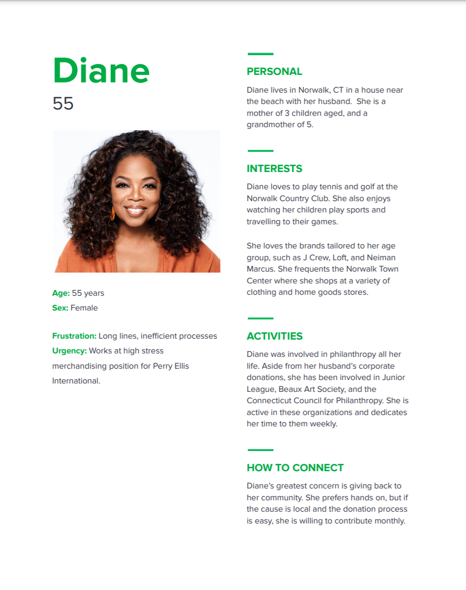 

### Persona 2 - College Student

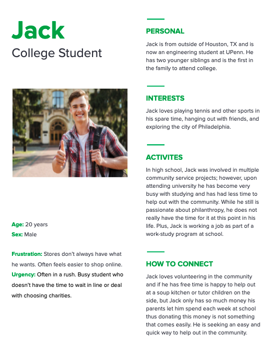 

### Persona 3 - Consumer Retailer

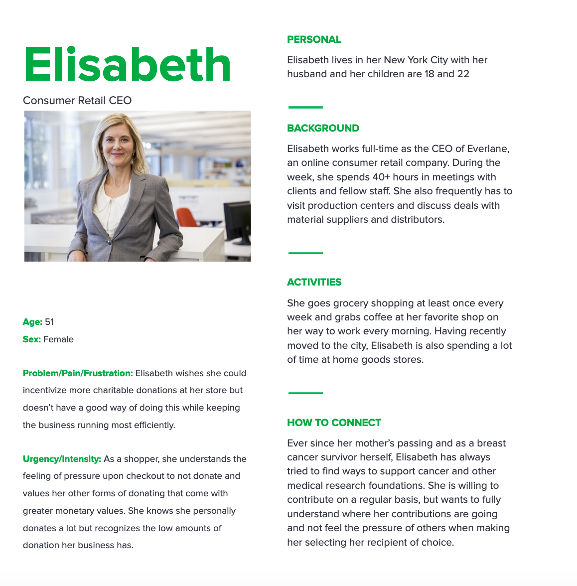

# Conversation Starters

1. Where do you mostly shop (clothes, groceries or other)? In store or online?

2. How often do you donate to charity? Are you or have you been involved with 
charities or nonprofits? 

3. Are you part of a rewards program with your favorite retailer? If so, what 
are the benefits of the program (free shipping, points, etc)?

4. Tell me about a time when something prevented you from giving more or 
being charitable.

5. What are the main problems or barriers/frictions you face when trying to 
be charitable? 
    Money (economic security)? 
    Time-consuming, effortful process? 
    Lack of information or options regarding causes or charities? 
    Are they the same factors that discourage saving (dislike present losses)?

# User Interviews

### Joan: VP of Merchandising at a B2B Retail Company, Perry Ellis International

- When did it happen: The interview with Joan, a head of merchandising at the 
B2B retail company Perry Ellis International, happened on March 29, 2021.

- How did it happen: We spoke over the phone, and the interview was recorded 
using Otter.ai so the information gathered from the conversation could be 
shared with other group members easily. 
 

### Rishu: College Student at University of Pennsylvania

- When did it happen: March 24, 2021
- How did it happen: We conducted the interview via Zoom and chatted for about 
30 minutes. We recorded the conversation, with consent, using Otter.ai so 
that we have a transcript of the conversation.
    
### Lesley: President of the Cashmere Sale (a division of Republic Clothing Apparel)

- When did it happen: March 29, 2021
- How did it happen: We conducted an interview in person and the interview was recorded using Otter.ai so that we could focus on the interview in the moment 
and re-run through the interview with other group members.
    

# Learnings from the User Interviews

### Learning 1

- We learned that B2B retailers are not viable options for this market 
design implementation because they don’t have an outward facing platform 
that can engage consumers. In terms of B2B philanthropic ventures, they still 
have a donation process, but it varies and does not rely on consumer donations 
for the most part. They tend to donate old clothes that did not sell well or 
were slightly damaged in the production process in lieu of strictly monetary 
donations. We learned that we should tweak our approach to the lack of charitable
donations to a market nudge tailored to the checkout page of consumer retail
businesses. 

- The other concept we discussed with this user persona was her experience as a 
consumer as well. Primarily, she pointed out that people are more willing to 
donate in front of other people, which sparked the idea for a community 
aspect to this market design nudge. She also explained that as you get older, 
people ask you for money everyday, so any nudge to donate to charity must be 
for something a person is passionate about and something we should incorporate. 
Even though donation fatigue is something we need to seriously consider, there 
is a way to work around it through engaging individual's social network or 
plugging into their passions surrounding philanthropic ventures.

### Learning 2 

- We learned that Rishu is open to donating a small "round-up" amount during self
checkout at grocery and drug stores like Acme and CVS. This motivated our feature
that would allow the user to select a preset amount or percentage of the order they
are comfortable with so that they can find donating more accessible and flexible.

- We also learned that college-aged donors like Rishu wants to know how the donation
money is used and where it has gone towards. This motivated our idea of allowing
the user to choose a cause they feel strongly about during the "one-time setup".
We also plan to provide a feature so that the user will see which project their
money went towards so that the donor has the peace of mind when they donate.

### Learning 3

- We learned that for small businesses like The Cashmere Sale, their 
partnerships with charitable organizations are extremely important not just for the benefit of making donations and being charitable, but also for spreading the word of their business and bringing in new customers. By partnering with a charity, The Cashmere Sale can host joint events with them and get access to the charity's email list. Lesley's business looks for organizations that they 
believe would have their most involved members be interested in their retail. Therefore it is beneficial for their business to be in control of the charities they are donating too.
- She does believe that there could be better ways to convince their customers 
to donate. Currently, they partner with Breast Cancer organizations throughout the country and usually pick a few items that upon purchase, The Cashmere Sale agrees to donate more money to their partnered Breast Cancer organizations. They partner with Breast Cancer organizations because they believe their main demographic of customers has a lot of overlap with the people most involved with these organizations.
- This led to the main takeaway being in order to maximize charitable donations, it is best to create a product that comes from the customer side rather than the business side. Businesses already have processes in place to donate to charities and work with charities, so the most realistic impact our product can have is by placing the power of donating into the hands of individual shoppers. While we can still interact with businesses, we want to make sure we do not prevent them from producing their own partnerships with charities.

# Storyboarding a Solution

## 1) The Traditional Online Shopping Experience

- Bob is a regular online shopper
- He buys clothes, groceries and other home products from a variety of online 
retailers
- The checkout process is already long and Bob dislikes having to spend time 
deciding whether he should donate, how he wants to contribute and reading 
through different charity options

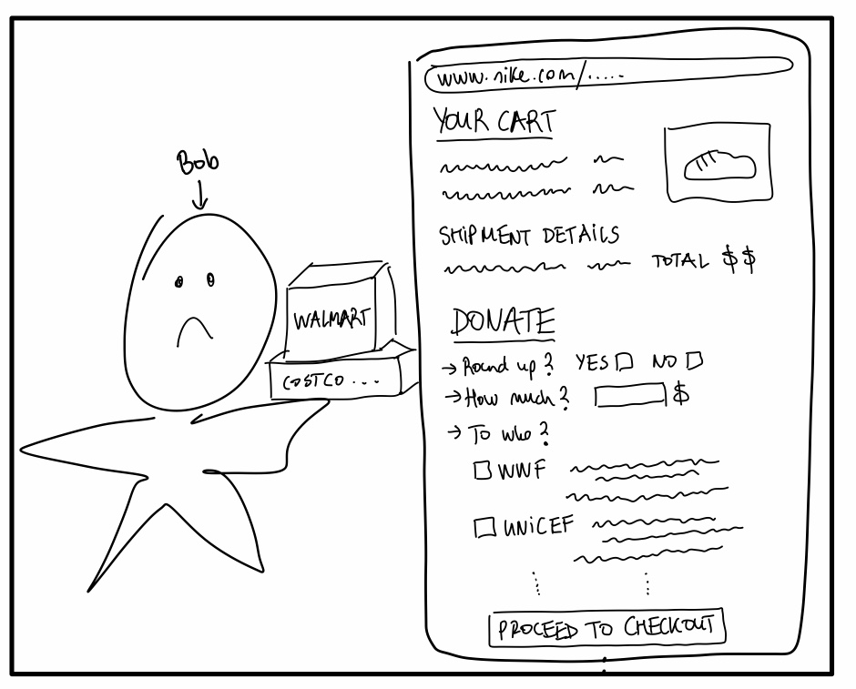

## 2) Download Chrome Extension

- With CareClub, Bob's friend Bill is effortlessly earning rewards (discount codes) for his contributions and gains extra satisfaction from his charitable actions
- Bob decides to download the extension to take advantage of those features and automate his donation preferences
- Pass-through contributions and potential for new customers are some of the incentives on the business side  

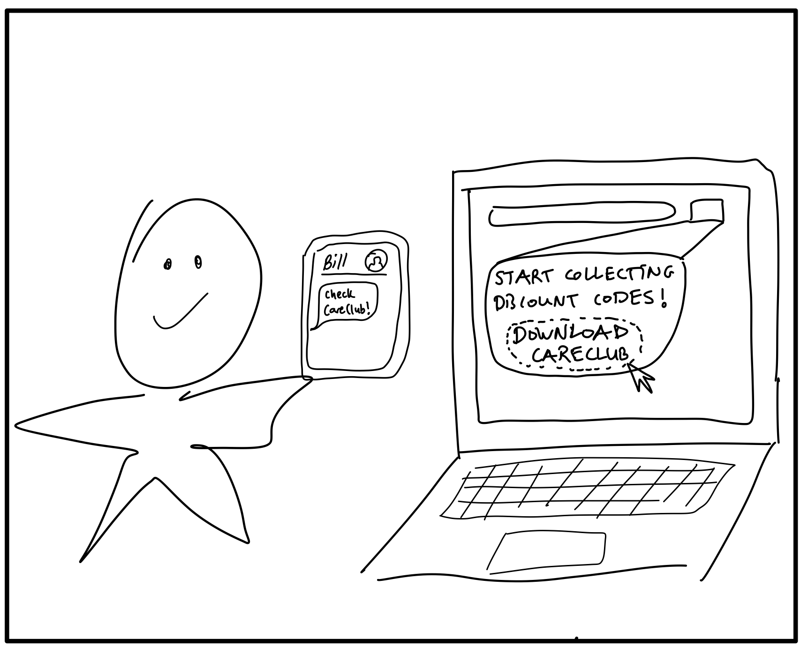
Our proposed solution is a chrome extension that automates the donation process (when available at online retailers) by attempting to leverage social norms, setting a good default, and appealing to cognitive ease. 

Throughout the semester, we have tried to get a comprehensive understanding of the frictions and motivations for giving. The rewards feature attempts to maximize ["warm glow giving"](https://econweb.ucsd.edu/~jandreon/Publications/ej90.pdf), the economic theory that describes how people's charitable contributions are largely driven by the selfish pleasure they receive from giving and "doing good". Further, the latest research by John List has highlighted the “relative importance of benefits to self as a driver of giving” (https://www.nber.org/papers/w26559). A statewide field experiment, undertaken in partnership with Alaska's [Pick.Click.Give](http://www.pickclickgive.org/) Charitable Contributions Program, found that individuals who received an appeal to self ("Warm Your Heart") were 4.5% more likely to donate and contributed 20% more than the control group. 

## 3) One Time Setup

- Bob is able to customize his donation preferences
- He selects the causes he cares most about and chooses his preferred donation method (round-up, fixed rate or flat amount) 
- Bob's preferences will be applied at checkouts (where available) 

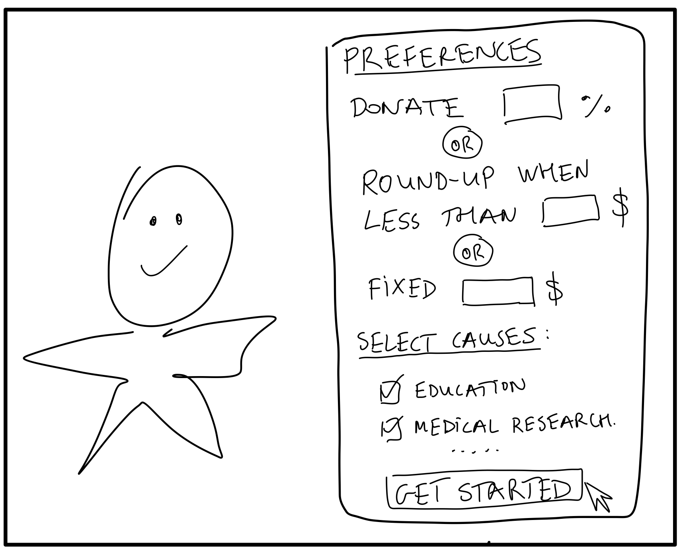
More specifically, we envision that the tool may suggest causes, and potentially charities, based on key impact metrics rather than simply by popularity or size. This particular feature would further appeal to the users who may have considered doing the thorough research and screening process independently to find the causes they care about and feel most attached to the measurable impact that their contribution will have.

## 4) Donation Opportunity

- A few days later, Bob makes a new purchase for Bill's birthday
- At checkout, he is prompted to confirm (or skip the donation) as the chrome extension applies his preset preferences
- He then completes the purchase effortlessly and knowing that the he cares about the cause he donated to

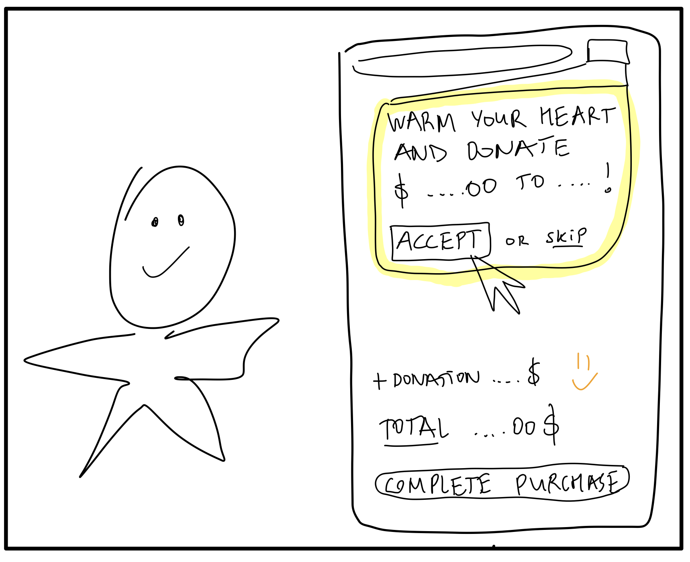
The message displayed with the donation opportunity is yet another reminder of how good it feels to give and uses the findings of the "Warm Your Heart" experiment.

We opted for keeping a confirmation stage in the automation process following user feedback on the storyboards.

## 5) Donation Summary 

- Bob is presented with a summary of his contribution
- He can share his charitable moment with his friends and other CareClub members
- Bob is only $X away from being able to claim his first discounts at a select range of online retailers!

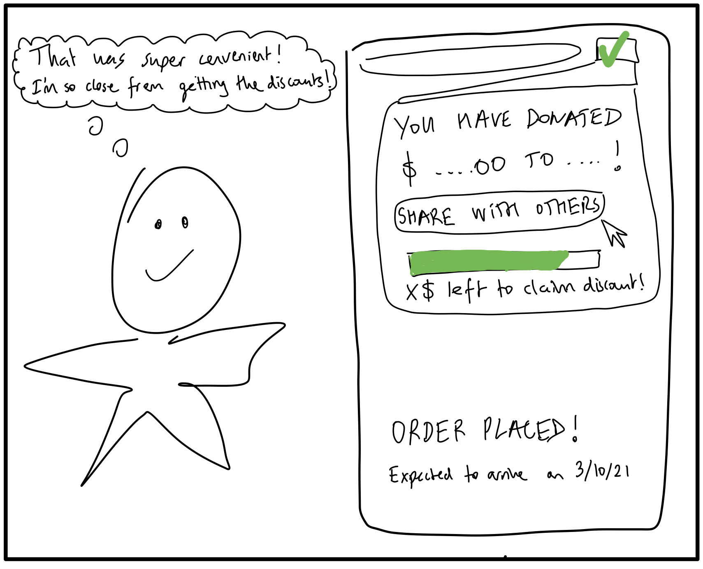

## 6) Donation Feed 

- Bob is able to interact with his friends and the CareClub community's charitable contributions
- He can also see his CareClub impact from his donation history 
- At any time, he can make changes to his automated preferences

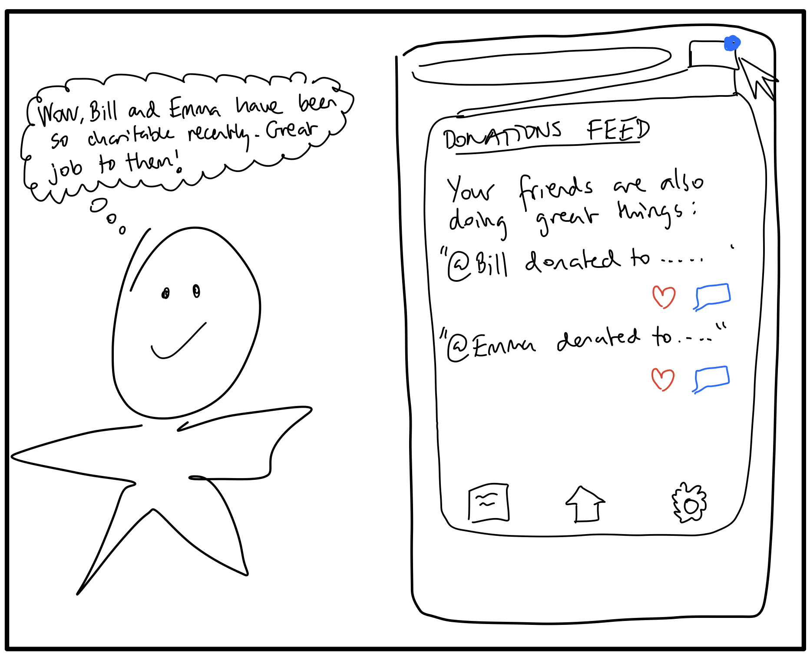
The social aspect of donating can be missed in an online setting and this social feed (inspired by Venmo) is an alternative to incorporate that. Here, our solution aims to use social norms. Research shows that individuals assess what the majority has done and attempts to behave in a manner that is fair or similar (https://directory.uleth.ca/users/debra.basil). Additionally, people who are indifferent about contributions react most strongly to information about others’ behavior and their contributions increase, on average, if they know that many others contribute (https://www.aeaweb.org/articles?id=10.1257/0002828043052187). Displaying the names of the people and friends who have donated as well as providing an integration with social media sets up this environment.

## 7) Rewarding Donations (value creation)

- Now, every time Bob completes his online orders he no longer has to reconsider his donation preferences
- CareClub makes him feels more rewarded by his donations and encourages charitable actions
- He is able to save time and is reassured that his personalized contributions are going to the causes he cares the most about

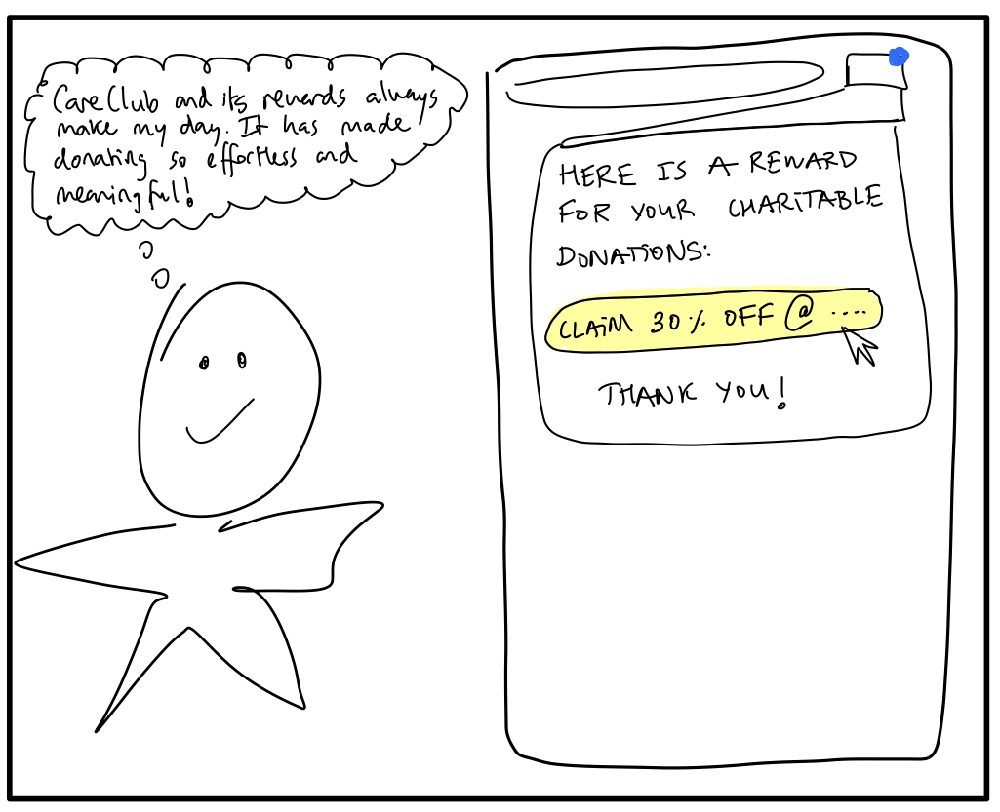

# Next Steps

Our project aims to make people feel more informed about their donations while 
doing the "most good" (effective altruism) with the least effort. We want people
to feel good about being able to donate when and how they want, to the causes 
that they care most about.

To fulfill such goals we envision exploring an extension that will learn to 
understand the user, possibly by using Google and CareClub member data. Our 
solution could provide recommendations and suggest retailers that offer donation
programs that better match the users’ desired causes. In addition, we could test
a recommendation system that would prompt returning users to raise their 
donation commitments leveraging the "foot-in-the-door effect" and ["Give More 
Tomorrow"](https://www.bloomberg.com/opinion/articles/2017-12-11/how-to-nudge-
people-to-give-more-to-charity) findings pioneered by Richard Thaler. We also
recognize that we have to make sure to build incentives for people to sign up
for CareClub in the first place. This requires utilizing marketing tools on many
different platforms, and also considering other incentives such as telling
people we will donate a certain amount of money if they sign up.

Ultimately, the immediate next step would be to quickly deploy an MVP with the 
goal of maximizing the amount of feedback acquired from target users about the 
potential of our product idea. This will let us know if our solution solves 
their problem and provide a base on which to iterate. We have began designing 
the first prototype which is previewed below.

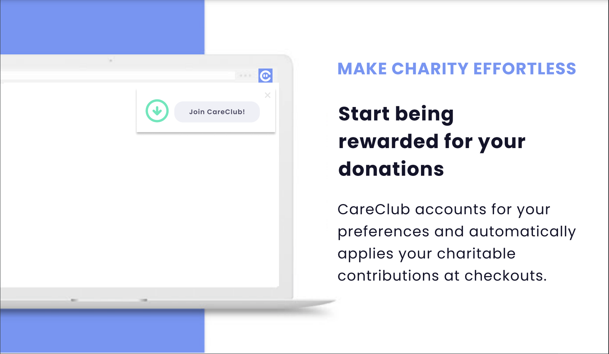

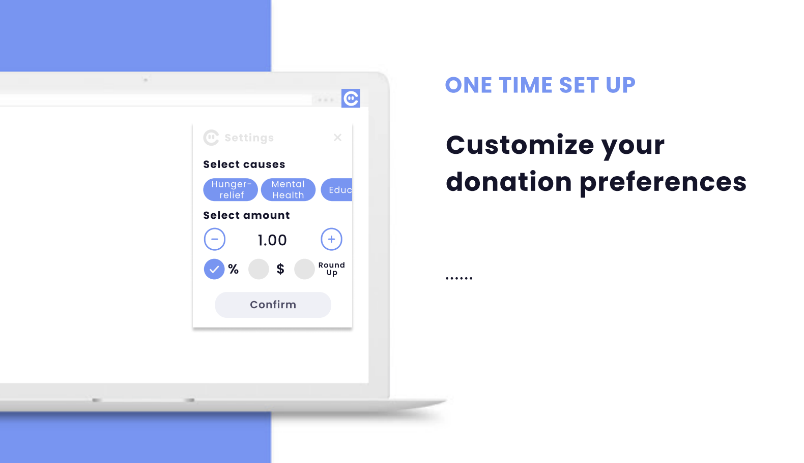
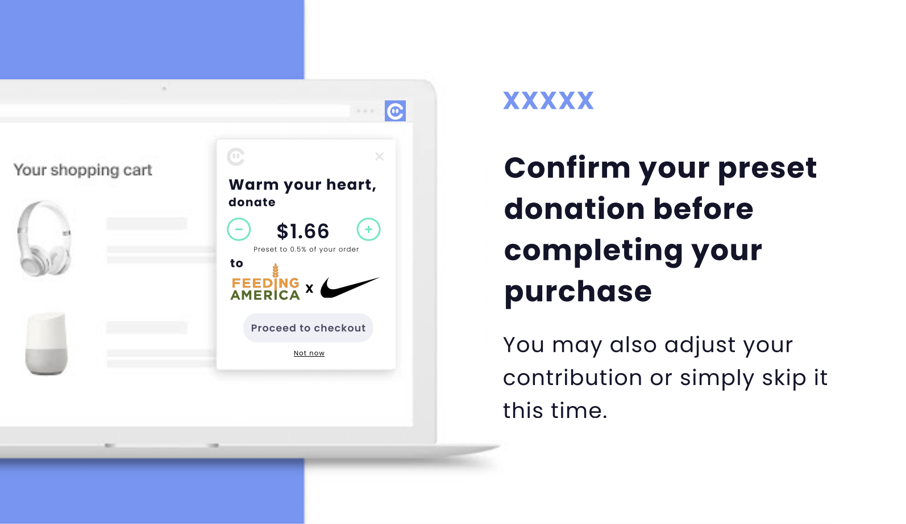
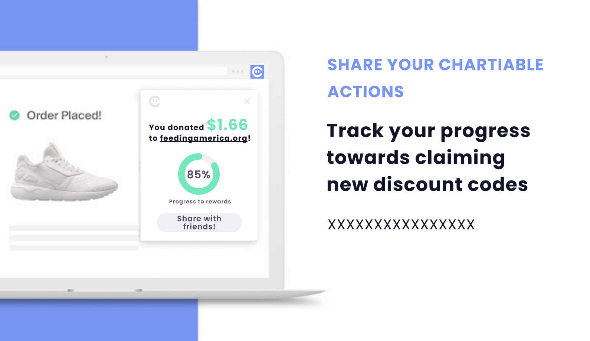
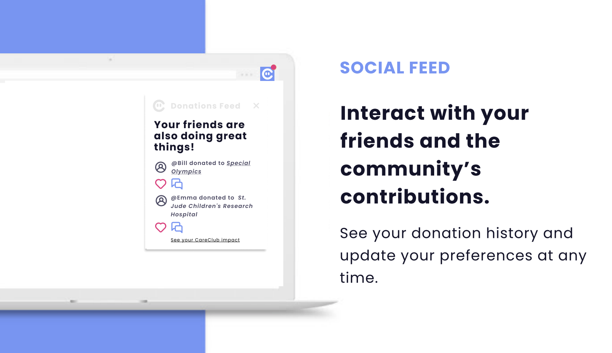
