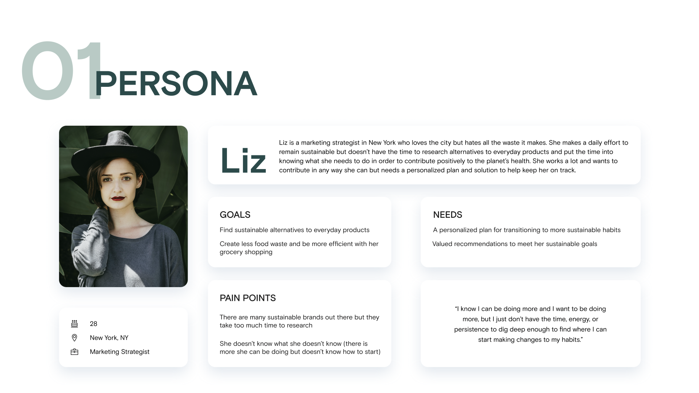
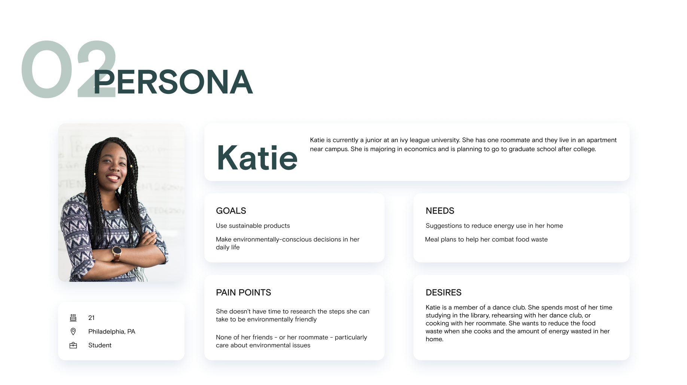
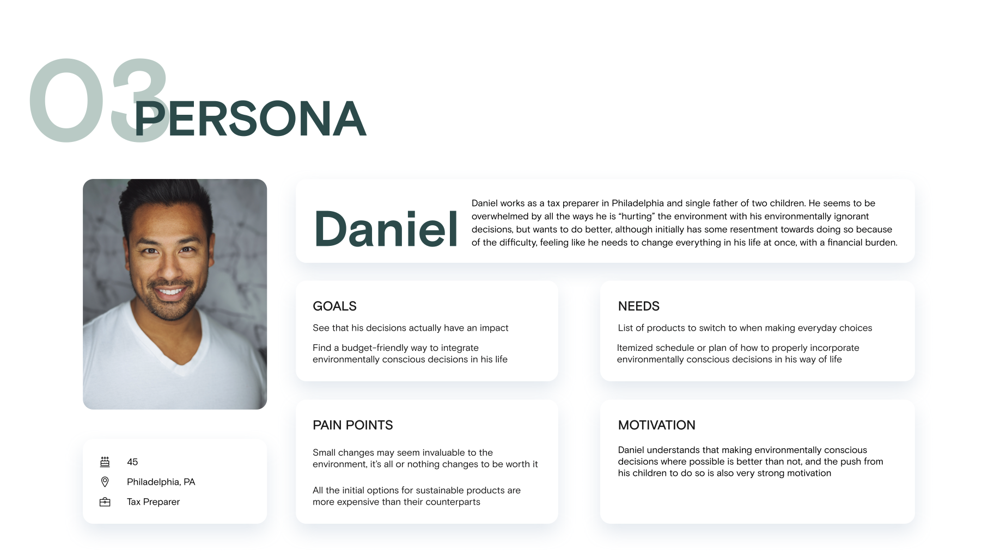
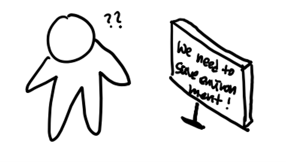
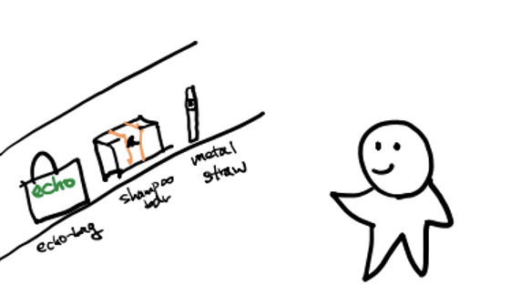
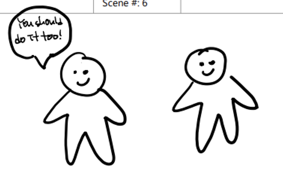
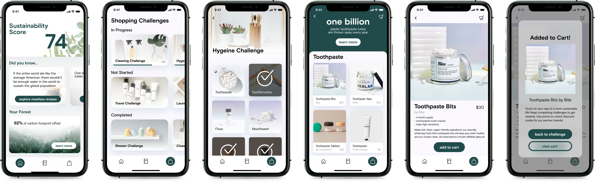

# Problem Statement

Place a short description (3 sentences max) of your problem. 

- Explain the decision inefficiency in the state of problem today.
 
- Why is it important or worth solving?

Climate change is a global investment good with no individual feedback available.

**People are not aware of the environmental impact of their choices, or how to create an environmental impact with their choices.**

An international push to net zero by 2050 will require informed, interested consumers driving a robust, global market of sustainable goods. 

# User Types

### Primary Users (Target Group)

- Core: Environmentally conscious adults willing to pay a premium for sustainable products.
- Extension: Family and friends, environmentally conscious low-income individuals (e.g. students).
- Emotional connection: Primary users must **consciously feel** using our tool encourages more environmentally-friendly decisions (this is their goal!) -> positive reinforcement key for primary users.
- Family and friends must **subconsciously be nudged** towards more environmentally-friendly decisions (they are using the tool primarily because of peer pressure, not true excitement over cause).
- Low-income individuals must consciously feel using our tool enables them to make their desired **environmentally-friendly decisions at low-cost** -> a tool that encourages (and at times requires) high-spending will have negative effect on this group.

### Suppliers (Facilitation)

- Products marketed through our platform. Target companies who would benefit most from additional marketing + exposure to interested consumers (e.g. early stage start-ups).
- A start-up’s greatest asset is their time -> this is the primary trade they are making. Time for marketing. **We must make their time worth it.** Partnerships with suppliers must yield positive results in the form of brand exposure and sales.

### Supporters (Environmental Activists)

- These people are likely to have the greatest impact through marketing of our tool than personal use.
- Perhaps the easiest group to please.
- **Must feel our tool will genuinely create a difference** -> want to share to with as many people as possible.

# Primary User Personas

### Liz

### Katie

### Daniel

# Conversation Starters

1. If you woke up one day and decided "Hey, I want to start helping the environment more," what would you do?
2. Do you know your own carbon footprint? -> Would you be interested in knowing your own carbon footprint?
3. On a scale of 1-10, how important is making environmentally-friendly decisions to you? -> Why not a 10?
4. Do you think that you produce more or less waste than the average American? -> Would you like to know the answer? -> How do you think your behavior would change if you knew the answer?
5. Do you anticipate changes in your feelings towards environmental causes over the next 5-10 years? What would be the primary causes of these changed feelings? 

# Meaningful Quotes from User Interviews

### Claire Kelly, Primary User

April 1st, Zoom

> I really want to help out the environment as much as possible, but I financially cannot make it a top priority while I am in college.

> Young people, I think, care the most about the environment. We’re the ones who have to live with the decisions we make now later.

> I think now is more important to be environmentally conscious than ever. At some point the damage we do will be irreversible and that’s so scary.

### Vivian Voth, Environmental Education Major (Supporter)

April 2nd, Zoom

> The problem with educating yourself about environmental causes is that the process is quite negative, you'll learn about oceans filled with plastic and animals going extinct.

> I think a lot of people don't know how to help the environment themselves, in their own individual lives.

> All sustainability movements start at the individual level.
    
### Marcelo Garcia, Primary User

April 3rd, Zoom

> It’s really hard to get parents and older people of older generations to care about the environment, because it’s not really high on their priorities. It takes a lot of help from close young relatives to teach them, but that’s something we can't do alone.

> My favorite part of work is teaching people about the environment, and how little it takes for us to change it. That’s why it’s important to have small daily habits that are helpful rather than harmful, because either way, it builds up.

### Jane Park, Primary User

April 4th, Zoom

> The reason why people are becoming more and more ignorant about environmental problems is because people, including myself, tend to regard the environmental problem as something too far away. They, we, are mostly interested in more micro-level, individual problems.

> The most critical part of solving environmental problems is providing incentives that can personally stimulate individuals and habituate making environmentally conscious decisions.

> If you want to keep your users' interest in your application, the best way is to give some fun to them. I think it’s really important to gamify the system and provide a certain level of entertainment to the users.

### Nora Schaper, Co-founder of [HiBAR](https://hellohibar.com) (Supplier)

April 7th, Zoom

> The biggest hurdle is asking people to make behavior changes for environmental reasons. We have to help them understand that it’s as effective as other well-known products and it’s an equal substitute and competitor.

> The biggest challenge was getting people to trust us. We really started gaining traction once our website supported customer reviews and customers started writing about what they liked about the product. Testimonials from existing customers go a long way.

# Learnings from User Interviews

### Positive incentives matter.

> "I will use it actively at first, but if there is no additional incentive or content that can arouse my interest, I probably won’t continue using it." - Jane Park

- We need to focus on the **positive** effects of individual sustainable decisions uplifts users, and make users excited to continue their efforts.

### Finances matter even more.

> "I find sustainable shoppping difficult because of the financial burden and lack of availability." - Claire Kelly

- Youth are the most passionate about climate change issues, but they also have the least money out of all consumers. Shift our core, primary user to low-income individuals like students, and design our tool to describe low-cost, high-impact choices available to consumers. 
- For older users, we are nudging them towards a significant behavioral change in consumer practices. They are more likely to make this change if it aligns with their economic interests.
- We must reframe the pitch of climate-conscious decisions from an expensive, but socially responsible choice, to an economic opportunity. This approach is mirrored by the Biden administration, which is pushing technological innovation over policies like a carbon tax, partly to encourage other countries into environmental action out of their own economic interest. 

# Storyboarding a Solution

### Frame 1

Jane is a UPenn freshman, interested in personally helping the environment, but with no idea where to start. Keyword search of "environment" on the app store leads her to Terra. 

### Frame 2

-	Now an informed consumer, Jane orders eco-friendly shampoos, metal straws, and other reusable products through Terra. 
- Jane regularly checks the visualizations and statistics on her carbon footprint, encouraged and excited by the progress she sees.
- She sets a goal to personally save 50 trees worth of paper by the end of the year, and Terra logs this intention. Terra will encourage her, and keep her accountable, in achieving her goal.

### Frame 3

- She shares her experience with friends and some of them also start using the application. Jane is excited to compare carbon footprints with her friends, and enjoys the social interaction on Terra. She finds it motivating.
- The actions of this growing web of individuals contribute to larger consumer movement towards more sustainable household products.

# Prototype

# Next Steps

- Engineer a MVP on TestFlight to include:

  - A sustainability score, informed by a one-time user survey.
  - Published feature importance of our sustainability score (so users can understand how it works).
  - Informational page on the global climate crisis, with links to longer references to learn more.
  - Personalized recommendations on how the user can improve their sustainability score, with user-enabled filtering and sorting (e.g. sort by *cost*, filter by *time required*).
  
- Learn from the MVP, potentially conduct a second round of user interviews. Improve UI features by adding visualizations of the positive effects of sustainable decisions, such as virtual trees saved, plastic waste reduced, etc. Game-ify sustainable choices by including badges, prizes, and experience levels.
- Next iteration - build a Marketplace and Community:

  - Reach out to suppliers, and based on the interested parties, launch a small-scale, niche Marketplace. Think Amazon's initial starting point as an online bookstore. The eventual goal is to be the hub of environmental information and products.
  - Add a Community element to capitalize on the effects of peer pressure and social activism. Users can create "Teams" and work towards collective goals and rewards.
  
- Long-term ideas:

  - Scan a product barcode and receive a "sustainability score" of the brand and individual product.
  - Integrate with smart household appliances (Nest, Alexa, etc.) to monitor individual energy use (before, could just have users input their monthly electrical usage from their bills).
  - Sort transportation options by their carbon footprint.
  - Match a user's "tree saved" with one planted -> 2x every user's impact. Use Ecosia as example. 
  - Reward engagement: the more you use the app, the more support you should provide to environmental causes around world.
  - Quantify the future dividends of immediate sustainable decisions. 
  
  