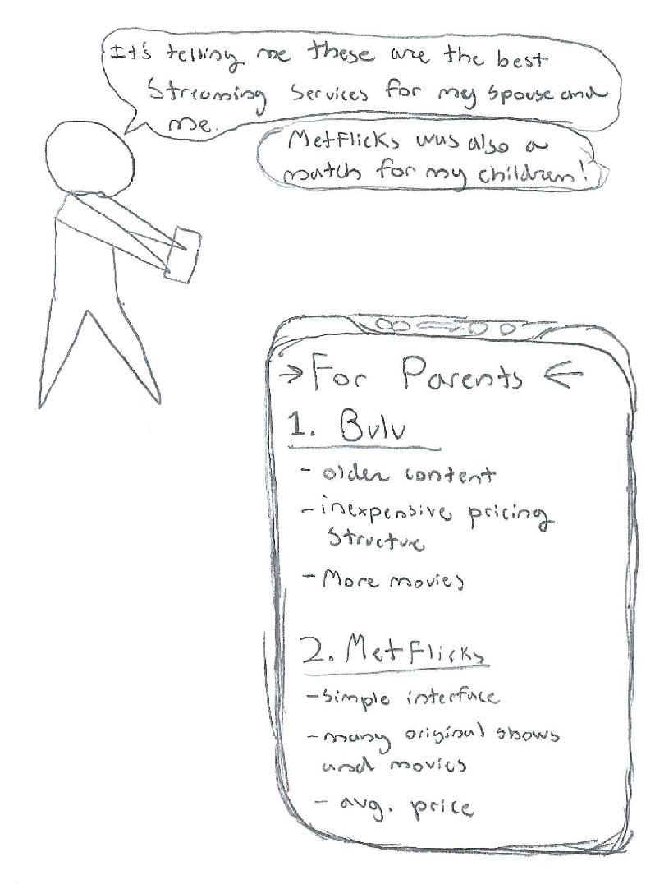

# Problem Statement

How can someone who watches TV choose the correct streaming service(s) that optimally matches their budget, interests, and lifestyle? With dozens of streaming services, all with different content, features, and pricing structures, choosing the best ones for yourself can be difficult and overwhelming. 

# User Personas

### Persona 1 

### Persona 2

### Persona 3

# Conversation Starters

1. What are your favorite non-physically-active, non-work activities?
2. What screen-based entertainment do you watch? Over what medium?
3. What ways do you entertain yourself that isn’t screen based?
4. What would your ideal screen-based entertainment platform look like?
5. Are you satisfied with your current screen-based entertainment? Anything you especially like or dislike? 

# User Interviews

### Nora, graduated young professional

- April 4, 2021
- Over the phone
 

### Scott, married with young kids

- March 31, 2021
- Interviewed via Zoom
    
### Mary, college student

- April 6, 2021
- In person, she is a mutual friend
    

# Learnings from the User Interviews

### Learning 1

- Time matters. Users make decisions on which streaming services to use depending on the time they have. If they had more time, they would watch more content and purchase more services and vice versa. 

### Learning 2 

- StreamAdviser’s algorithm will need constant updates. The popular show of the month, or even week, will impact a person’s decision to pay for a streaming service.

### Learning 3

- Finding an empty nester was difficult because of generational gaps. Most older empty nesters are not as familiar with digital streaming as empty nesters will be in 10-20 years (or even sooner). 

# Storyboarding a Solution

## Frame 1

- The user does not want to waste money on excessive streaming services
- There can be many users who have to share the same streaming services
- It’s difficult to know off the top of your head everything about every streaming service 

## Frame 2

- A streaming service should be able to be chosen for the user after simply inputting preference and demographic data
- The program can rank which services are the best for the user
- The program breaks down each service clearly and simply

## Frame 3

- The program should be able to take a number of inputs, such as budget, data on family, demographics, show preferences, etc.
- The user should be able to easily input this information and/or skip any questions if they don’t have information on it

## Frame 4

- The program breaks down which service is best for each category/group represented in the “family” (in this example, children)
- It also details specific reasons as to why the listed services best fit the criteria inputted in frame 3, including the types of shows, potential parental control features, and prices

## Frame 5

- The program breaks down which service is best for the next category/group (in this example, parents), as well as the reasons why the listed services are a good fit
- The user should be able to notice overlapping services between the categories/groups

## Frame 6

- Since a lot of users use friends’ or relatives’ streaming service accounts, our program needs to take this into account so that it doesn’t recommend a service that the user already has access to

## Frame 7

- The program consolidates the user’s preferences and outputs recommendations for which services the user should sign up for
- Given that users are willing to spend different amounts of money paying for services, the program provides three tiers with different prices
- The user chooses which tier best matches their needs

## Frame 8
- Ultimately, the program consolidates user preferences into recommendations as to what the user should sign up for
- The program can be utilized again if family dynamics or user preferences change

# Next Steps

Next steps include both data collection and algorithm creation. 

First, data collection involves accumulating data that summarize the advantages and disadvantages of each streaming service, including the variety of genres each service offers, whether they focus more on movies or TV shows, and how often they update their shows/movies, among other traits. This would also entail analyzing the user profiles, genre preferences, and demographic information of each service’s subscription base. 

From there, we would focus on creating a recommendation algorithm that inputs user information and preferences, and outputs subscription recommendations and prices associated with these recommendations. This algorithm would be based on past users’ data, and would continuously be updated with new shows and services.
