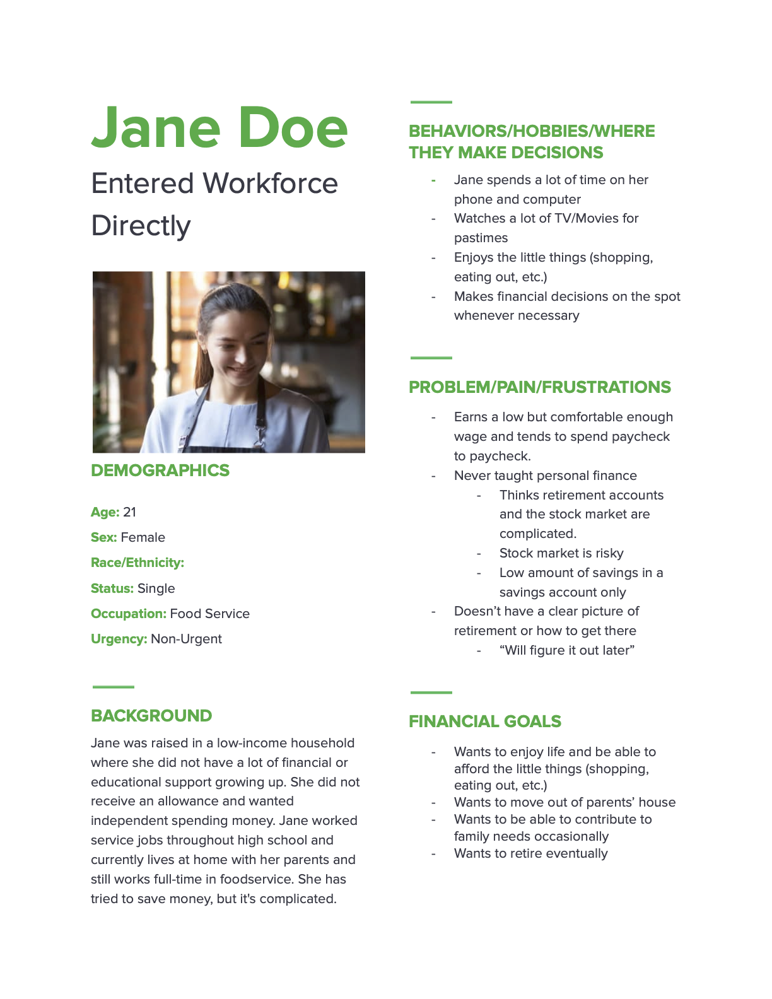
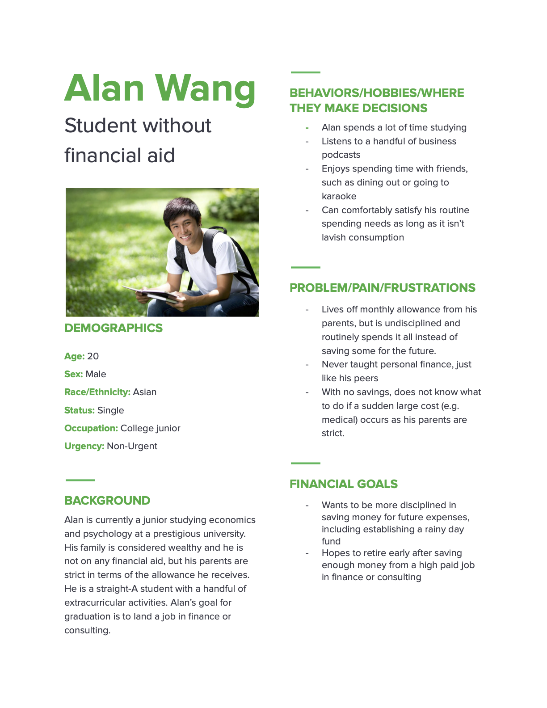
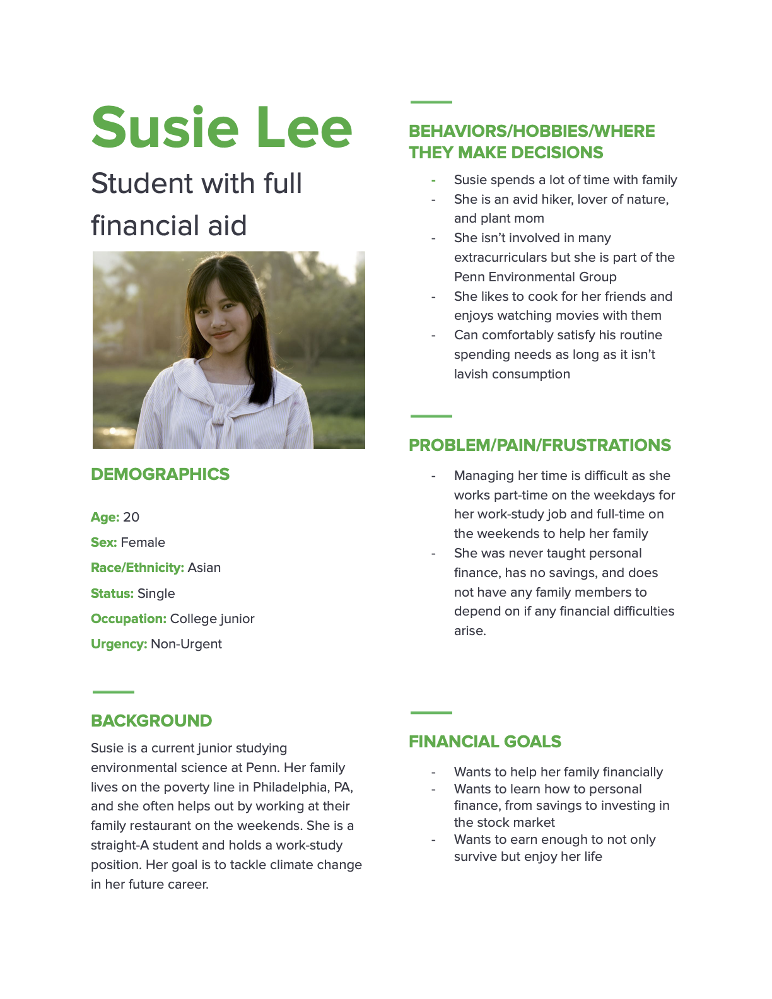
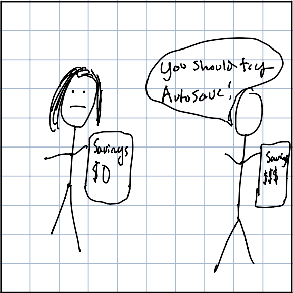
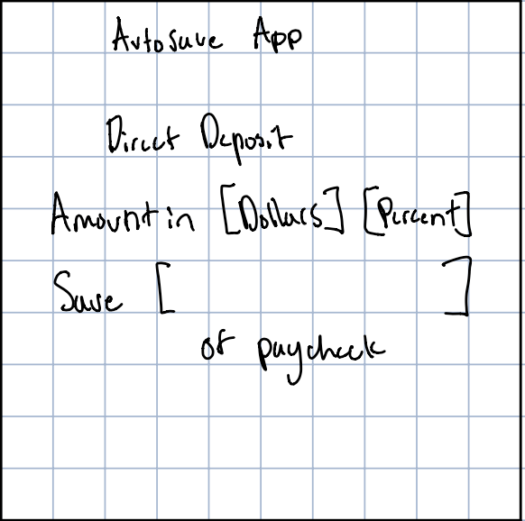
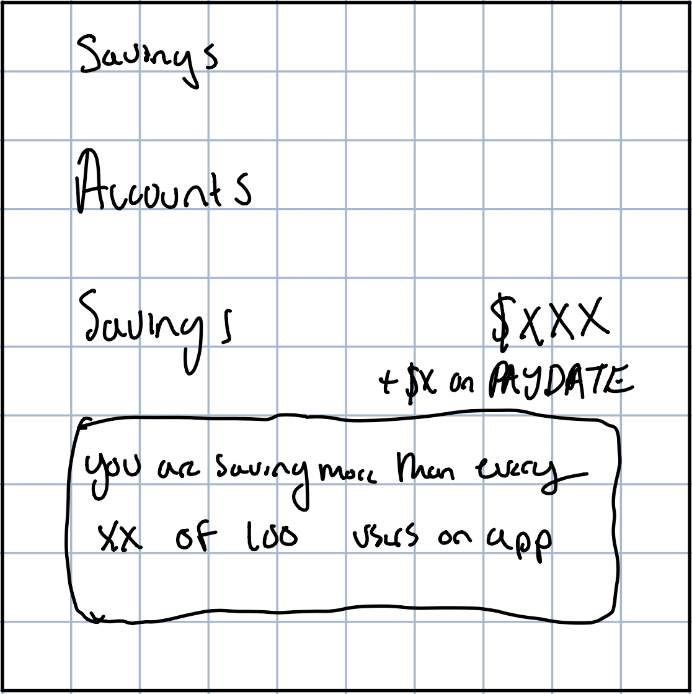
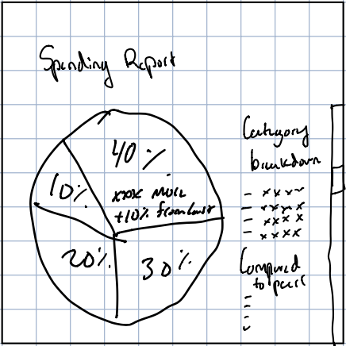
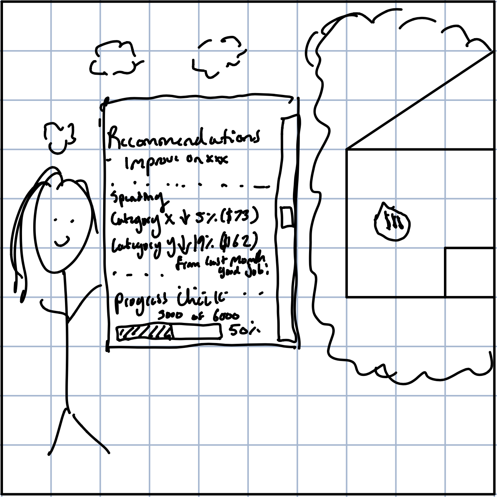
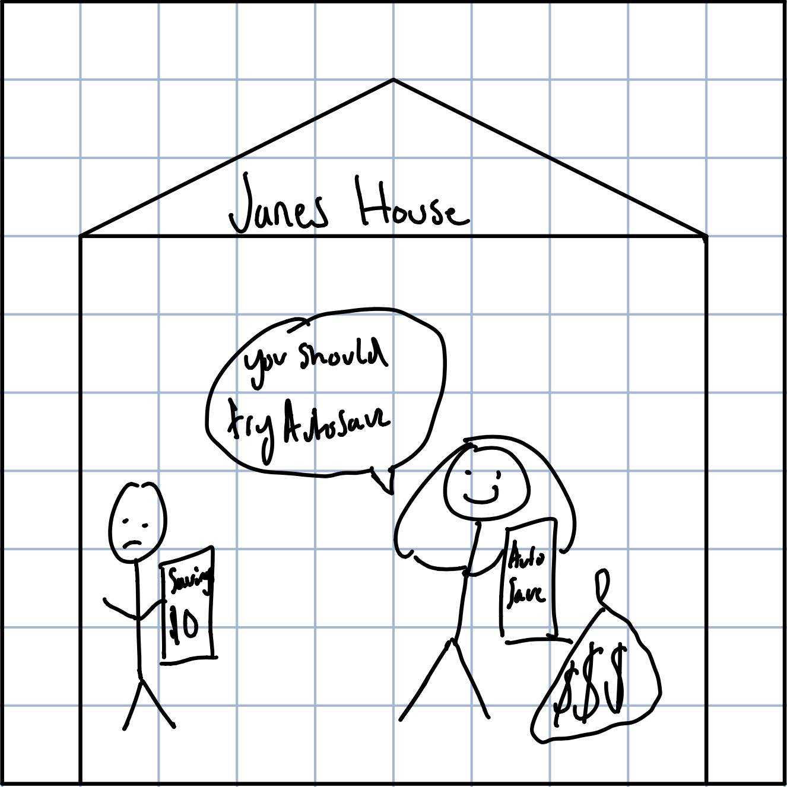

# Problem Statement

It is a known fact that Americans do not save enough, whether for rainy days or for retirement. Research has shown 69% of Americans have less than \$1,000 in savings, and 39% of Americans would be unable to pay an emergency expense of more than \$400. This is concerning because it shows that the majority of Americans aren’t financially prepared for the unexpected, which we’ve seen during the pandemic with mass layoffs and record-high unemployment rates.

# User Personas

### Persona 1: Jane Doe (Entered Workforce Directly)

### Persona 2: Alan Wang (Student without financial aid)

### Persona 3:Susie Lee (Student with full financial aid)

# Conversation Starters

1. Do you have a plan for your savings and future? Is there a reason you are saving that much?

2. Where are savings in terms of your financial priorities?

3. What are the biggest challenges you face in saving money?

4. What has been most beneficial in helping you save money?

5. If you had extra money right now, what would you do with it? 

# User Interviews

### Interview 1 Name: Pharaoh Tyehimba (Entered Workforce Directly)

- When did it happen: April 2021
- How did it happen: Interview was conducted via video call through zoom, guided by a set of pre-selected questions, as well as some open-ended questions as fit in the conversation.
 

### Interview 2 Name: Jason Chau (Student Without Financial Aid)

- When did it happen: April 2021
- How did it happen: Interview was conducted via phone call, guided by a set of pre-selected questions, as well as some open-ended questions as fit in the conversation.
    
### Interview 3 Name: Sharmari Harrington (Student with full financial aid)

- When did it happen: April 2021
- How did it happen: Interview was conducted in person, guided by a set of pre-selected questions, as well as some open-ended questions as fit in the conversation. 
    

# Learnings from the User Interviews

### Learning 1

Learning 1:  “I don’t know how much I should be saving, and I don’t have a plan.”

- This tweaked our understanding of our user problem as it showed that the main problem hindering savings was not that people cannot save, but that they genuinely don’t know how to save or have a solid plan for it. Many don’t save because they don’t even know how to begin. To account for this, we needed to find a way to guide users towards concrete savings goals. This led us to automatically generated goals, as well as the product sign-up prompting goals by default. 

### Learning 2 

Learning 2:  “I tend to go through impulsive buying because I easily forget my savings goals, especially on a daily basis.”

- This tweaked our understanding of the problem because it helped us identify one of the primary challenges our prospective users faced in building their savings. Savings is a long-term pursuit, and we needed a way for people to continuously save without much effort. This led us to automatic withdrawals into the savings account before money can even be spent, eliminating the issue of impulse buying.

### Learning 3

Learning 3: “I only save when people have both a surplus of money and am consciously thinking about savings.”

- This tweaked our understanding of the problem because it helped us realize the necessary conditions for many of our prospective users to save. They need to have both a surplus of money and be consciously thinking about adding to savings. We needed to find a way for our product to help people achieve these conditions effortlessly. This led us to daily challenges combined with automatic withdrawals, empowering users to meet both conditions. Users are nudged to save more money, and automatic withdrawals eliminate the need for conscious thinking.

# Storyboarding a Solution

## Frame 1: Meet Jane

- Point 1: Jane was raised in a low-income household and did not have a lot of financial support or education growing up.

- Point 2: Jane currently works in foodservice and lives with her parents at home.

- Point 3: Jane has tried to save money, but it’s complicated. She wants to move out of her parents' house.

## Frame 2: Jane Signs Up

- Point 1: Jane heard that AutoSave is an easy-to-use financial account that is focused on helping her save and reach financial independence.

- Point 2: Jane signs up for an account with checking, savings, and retirement accounts all incorporated into one easy-to-manage app.

- Point 3: Jane sets up a direct deposit of her salary onto the app, and is prompted to divide her incoming payments into checkings/savings/retirement accounts by default. 

## Frame 3: AutoSave helps Jane Track her Savings

- Point 1: AutoSave generates goals, and prompts Jane to manually add goals. She adds a goal to save for a down payment on a house.

- Point 2: Each time Jane gets paid, as well as periodically, she receives a notification with a breakdown of her accounts and progress towards her goals.

- Point 3: Jane also looks at her savings performance compared to others, and uses it as a benchmark to start saving at a rate comparable to her peers on the app. 

## Frame 4: AutoSave helps Jane cut her spending

- Point 1: AutoSave learns Jane’s spending habits over time, producing real-time, on-demand reports that allow her to systematically track and understand her spending habits. 

- Point 2: Jane compares how much she is spending relative to others in her area and demographic, and looks at recommendations on how she can improve.

- Point 3: Jane sees that she is spending way more money on food and transportation than she previously thought, and much more than her peers. She aims to cut down on spending going forward.

## Frame 5: AutoSave helps Jane cut her spending

- Point 1: AutoSave comes up with recommendations and tailored daily challenges to help her cut spending and reach her savings goals. 

- Point 2: When she completes these challenges, AutoSave automatically moves the money she saves as a result of the challenges into her savings accounts.  
(e.g. Jane usually spends \$15 a day on food, she successfully completes her challenge to spend only \$10 on food, so AutoSave automatically deposits \$5 into her savings.)

- Point 3: Jane continues to work towards her goal of saving for a down payment, and faces constant nudges to spend less without needing to be fully conscious of her savings. 

## Frame 6: Jane's Results

Point 1: After a period of time using the app, Jane has accomplished her goal of saving enough for down payment and is continually building her savings.

Point 2: Before AutoSave, Jane had no plans for her finances at all. Now, she has a savings account, a retirement account, and a solid plan for her finances.

Point 3: Jane is satisfied with how her financial situation has progressed since signing up for the app, and recommends it to her friends.

# Next Steps
Some next steps we anticipate include the following:

- Conduct more user interviews to better understand our target audience.

- Create a digital prototype of our product using UI/UX tools.

- Once a digital prototype is created, hold a focus group to see how people interact with the product.

- Make adjustments and iterate based on insights from user interviews and focus groups.

- Formulate a plan to scale the product.
