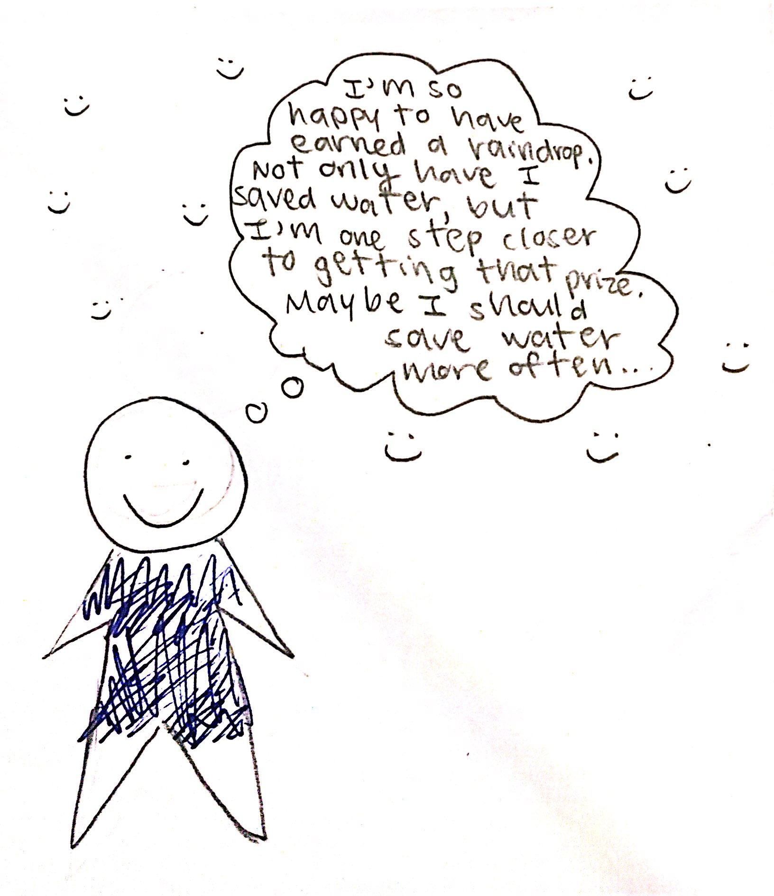

# Problem Statement

The current decision inefficiency surrounds the lack of water data access and unawareness of the growing water waste problem. We are attempting to increase accountability among Penn students to influence them to conserve water by increasing access to data for staff and students, as well as employing notifications to influence their decision making. Water conservation is important to ensure the preservation of a healthy planet for future generations.

# User Personas

### Persona 1 
  

### Persona 2

### Persona 3

# Conversation Starters

1. How much water do you think you use in a week?
2. How environmentally conscious do you consider yourself?
3. Do you think your water expenses are on the higher or lower end?
4. Do you have an example of a time that you conserved a resource, and better yet, water?
5. Do you think you can go through an entire day without water (except for drinking)?

# User Interviews

### On Campus Student Interview

- April 6, 2021, 3:00pm EST
- In the interview, Caleb Blackburn led the questioning. After introductions, the interviewee was asked a series of question regarding their opinion on water conservation, the student's past experience with water conservation, and the student's access to water usage data. The interview was conducted over Zoom and lasted approximately 20-25 minutes.
- Interview Transcript: https://drive.google.com/file/d/1_njpsQpLY7edODi_g3wRQ8jdzFSroZ_c/view?usp=sharing
 
 

### Off Campus Student Interview

- April 6, 2021, 4:30pm EST
- In the interview, Denise Bonsu led the questioning. After introductions, the interviewee was asked a series of questions regarding their opinion on water conservation, the student's past experience with water conservation, and the student's access to water usage data. The interview was conducted over Zoom and lasted approximately 20-25 minutes.
- Interview Transcript: https://drive.google.com/file/d/1V02UUpDhNutR_JbSD5gzELRkZYS1zeER/view?usp=sharing

    
### Housing Admin Interview

- April 2, 2021, 10:00am EST and April 7, 2021, 9:00am EST
- In the interview, both Vasya and Serena took turns asking questions and gaining insights from the housing admin. Vasya and Serena conducted two interviews because the first admin recommended that they talk to another admin that had more access to facilities and water data. After introductions, the interviewees were asked a series of questions regarding their opinions on water conservation, the admins' past experiences with water conservation, their role with water conservation on-campus, and the admins' access to water usage data. In addition, Serena and Vasya asked the admins about their personal and other motivations on water conservation. The interviews were conducted over Zoom, and each lasted approximately 45 minutes.
- Interview Transcript part 1: https://docs.google.com/document/d/1n948yCrGovfpU3JSm66p6w90zvzsqKggtagaJLcFhzc/edit?usp=sharing
- Interview Transcript part 2: https://docs.google.com/document/d/1fiOPGzTwTU_D44i-XBIGqvJEHKqkeaLNfEvsR7psvUU/edit?usp=sharing
    

# Learnings from the User Interviews

### Learning 1 - On Campus Tweak

We discovered that no on-campus students have any access to their water usage data, making it impossible to make people more cognizant of their possibly wasteful actions. Our tweak is, thus, that the data is unavailable, and that we must make it available to on-campus Penn students. Furthermore, there is currently no incentive to save water, so we must create incentives.

### Learning 2 - Off Campus Tweak

We discovered that some but few off-campus students have any access to their water usage data, and those that do have access have not been incentivized to conserve more water. Our tweak is, thus, that the data and incentives necessary to conserve water are unavailable, and that we must not only make the data available to all students, but also create the interface to grant these off-campus students the proper incentives to conserve water.

### Learning 3 - Housing Admin Tweak

We discovered that housing administrators for the most part do not have access to the information that might help them make their students better conserve water, i.e. water usage data. Our tweak to our problem statement is therefore that administrators do not have the proper data to influence water conservation, and thus, we must propagate the data among administrators. We hope to create internal infrastructure and promote awareness to enable admin to influence water conservation practices.

# Storyboarding a Solution

## Frame 1

After moving in, John attends a welcome session with the housing admin and learns about water conservation on-campus. Later, he reads the news and becomes more aware of the stories about water waste.

## Frame 2 to N-1

He sees a flyer on his desk about a water saving competition between the houses and the new water tracking interface and decides to sign up for the system.

John wakes up the next day and takes a shower, without keeping track of how much time the water runs for.

When John is finished, he gets a notification on his phone, showing that he showered for less than the average shower time in his college house, he receives a "rain drop."

John smiles at the positive feedback, as he knows that the rain drops can be redeemed for prizes with his housing admin. 

Tori, the administrative coordinator, sent John the virtual “rain drops” from her device, since she noticed that his water usage went down. Tori is happy because her building is saving money, and that her residents are conserving water.  

To incentivise further water conservation, Tori tells her student worker assistant to hang a poster in the lobby of the building, since she wants her residents to save her building money, and save the environment. 

John comes home from a long day of studying and is notified that his building is the most environmentally friendly dorm on campus in terms of water consumption, as well as notices the new poster. His friends visiting his dorm notice this and start thinking about their own water usages & houses.

## Frame N (final frame)

Now every time John takes a shower, he showers for less than the college house average, saving water, he now decides in favor of his incentives. Water is conserved.

# Next Steps

Next steps would be to take advantage of the possible synergy between our app idea and the existing Penn Mobile app. This app gives students information about the hours and food available at dining halls, as well as the availability of washer machines and dryers in their college house. We could introduce an interface within the Penn Mobile app to show students the information about water usage in their dorm rooms (similar to the app showing students the information about the usage of washer machines and dryers). Each student can find their exact housing assignment on Campus Express. Campus Express is integrated into Penn Mobile, so we could find a way to show each student the water usage data for their exact housing assignment (ie. their dorm room).
