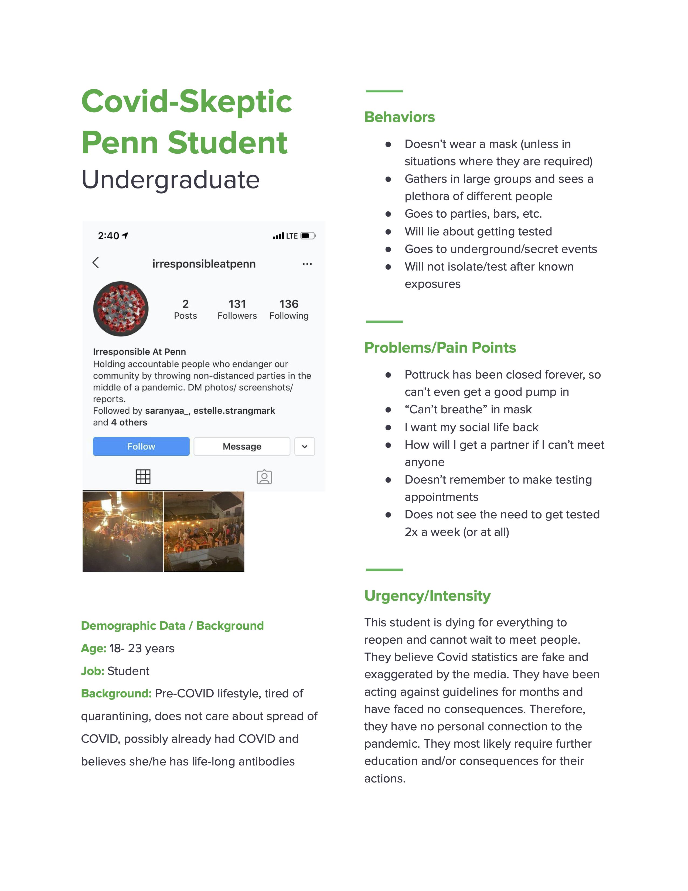
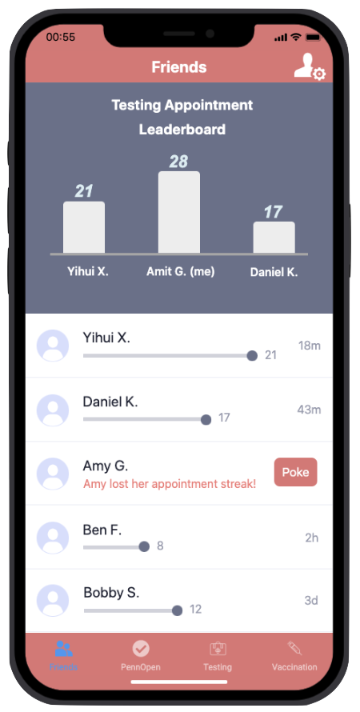

# Problem Statement

Place a short description (3 sentences max) of your problem. 
- Explain the decision inefficiency in the state of problem today.
- Why is it important or worth solving?

Our decision problem focuses on how we can improve Covid-testing policies at Penn to get 100% of the student body tested twice a week. Not all students fully participate in testing at Penn despite it being available for free, and we wanted to find out why. This is important because Penn's Covid recovery directly impacts the local Philadelphia community both health-wise and economically, and proper adherence to Covid-testing is key to opening campus back up safely.

# User Personas

### Persona 1 

### Persona 2

### Persona 3

# Conversation Starters

1. How often do you get tested?
2. How would you rate the testing appointment scheduling experience in terms of usability?
3. Do you think the consequences for violating Penn's Covid Student Campus Compact are too light? Too severe?
4. How often do you complete PennOpen Pass and why?
5. Have you ever tested positive for COVID? 

# User Interviews

### Interview 1 Name

- When did it happen
- How did it happen
 

### Interview 2 Name

- When did it happen
- How did it happen
    
### Interview 3 Name

- When did it happen
- How did it happen
    

# Learnings from the User Interviews

### Learning 1

- what did you tweak in problem or persona understanding

### Learning 2 

- what did you tweak in your problem or persona understanding

### Learning 3

- what did you tweak in your problem or persona understanding. 

# Storyboarding a Solution

## Frame 1

In the first frame start with the user and their basic situation/problem before experiencing your solution. 

- Amit is a junior at Penn who wants to be COVID-safe but forgets to get tested regularly.
- He tries his best to follow COVID regulations according to Penn’s campus compact, but finds that it’s difficult to manage classes, a social life, and his mental health with pandemic safety.
- He understands the importance of testing but  but finds the restrictions around scheduling an appointment complicated and too annoying.

## Frame 2 to N-1

Explain each frame with bullet points

- Point 1
- Point 2
- Point 3

## Frame N (final frame)

Illustrate the value creation in the final frame (e.g., problem solved!)

# Next Steps

What are your next steps if you pursue the project further

If we pursue the project further, the next step would be to reach back out to the Penn Covid Task Force and ask for a sit-down with them to understand the challenges they face as well as to potentially propose a few of our solutions.

To go a step further, we thought of building an all-in-one app that keeps track of everything Covid-related: testing appointments, results, open pass, and eventually Covid vaccination records. Additionally, we can incorporate a gamified and social component within the app in order to incentivize students to get tested regularly.

