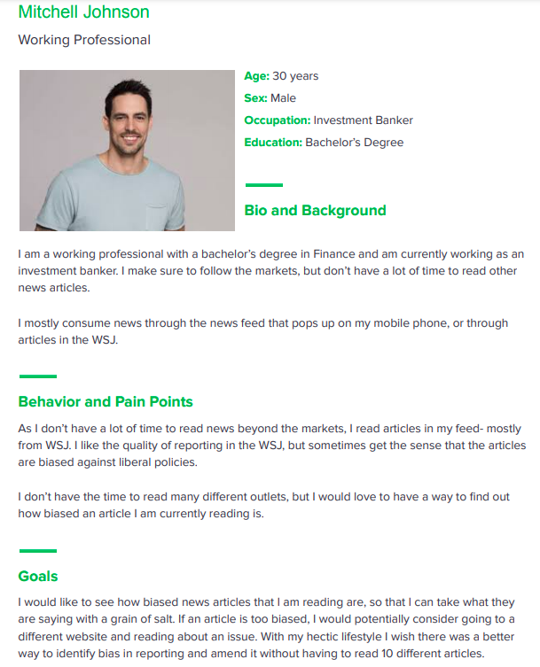
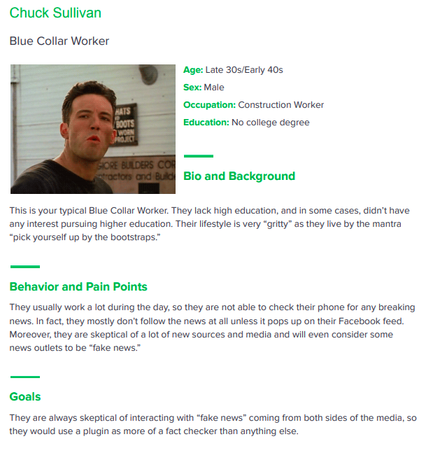
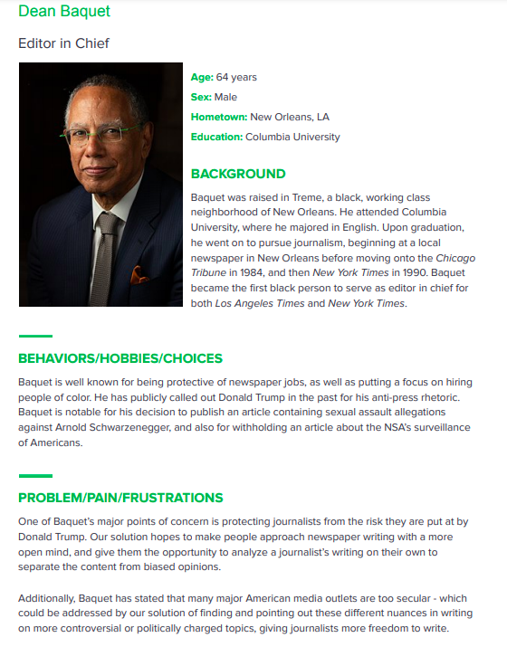
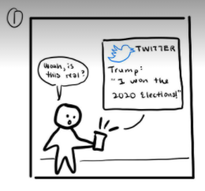
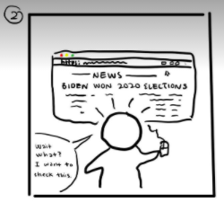
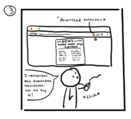
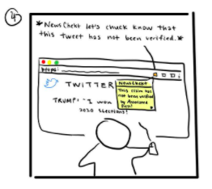
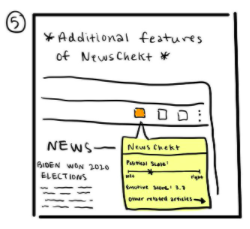
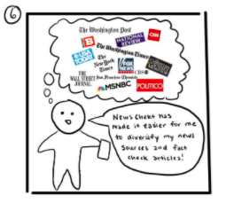

# Problem Statement

News and media bias permeate our social media and news consumption experience. Targeted algorithms repeatedly push similar news and information to users and lead to confirmation bias. This makes it difficult for people to engage their System 2 thinking and consider alternative narratives of the same news.

# User Personas

### Persona 1 

### Persona 2

### Persona 3

# Conversation Starters

1. How do you read the news? (what apps do you use, or paper news, what sources do you read from)
2. How often do you read the news and how much time do you spend reading the news?
3. What makes news outlets trustworthy and credible for you?
4. Show logos of news outlets (CNN, Fox, OAN). What do you think of these outlets?
5. Do you find the fact-checking feature on Twitter to be useful?

# User Interviews

### Investment Banking Professional

- The interview was conducted in the 2nd week of April over Zoom.
- The key takeaway was that the person did not engage with news online very deeply (did not read it often and did not spend a lot of time reading it) and only engaged with news online if it was alarming or attention-grabbing.
 

### Construction Worker

- This interview was conducted in the 1st week of April over Zoom.
- The surprising thing that we learned from this interview is that the user was suspicious of not just one, but all media outlets as he believed that all of them had an underlying agenda.
    
### News Editor

- This interview was conducted in the 2nd week of April over Zoom.
- The news editor acknowledged the fact that more and more media outlets are trying to cater to their specific audiences. This necessitates checking news articles for factual accuracy and bias.
    

# Learnings from the User Interviews

### Learning 1

- The investment banker told us that he engaged with print media much more deeply compared to online news articles.
- We encourage people to engage their System 2 and think critically when reading news articles online by highlighting strong language in the articles.
- We try to make the experience of reading news online as close to that of thoroughly reading a newspaper.

### Learning 2 

- While the construction worker believed that every media outlet was biased, he was passionate about no one being 'muzzled'.
- This motivated our dedication to avoid censoring any news content using our plugin.
- The plug-in provides a fact-check feature and highlights strong language, but does not prevent a user from reading any article.

### Learning 3

-  We wanted to incorporate some kind of "bias" rating in our plugin
- The news editor said that users needed to understand where the bias rating was coming from instead of just seeing a score on a scale of 1 to 10
- So, we decided to highlight specific words and assess the tone of the article rather than just providing an overall bias score. 

# Storyboarding a Solution

## Frame 1

- Meet Chuck: Chuck is on his way to work when he sees that President Trump has tweeted out that he has won the 2020 Presidential election.
- Chuck normally only skims news headlines, but as the elections are an important political event, he’d like to find out more.

## Frame 2

- Chuck navigates to a news article which says that Trump has lost the election, while Trump claims that he won by a landslide. 
- Chuck wants to know who is really telling the truth in this scenario. 

## Frame 3

- Chuck remembers hearing about NewsChekt and their fact-checking feature for news articles. 
- He decides to give it a try and installs the plug-in. 

## Frame 4

- The plug-in tells Chuck that the claims made by Trump have not been verified by the Associated Press, as well as other established media outlets such as CNN, Fox, and NBC.

## Frame 5

- Chuck starts reading news articles regarding the election with the NewsChekt plugin installed. 
- The plugin provides Chuck information about where the media outlet that published the article lies on the political spectrum, and highlights any strong language.
- The plugin also suggests other similar articles published by media outlets on varying scales of the political spectrum so that Chuck can get his information from a diverse set of sources. 

## Frame 6 (final frame)

- Using this plugin, Chuck can fact-check claims and understand what makes news articles biased. 
- He can still choose what to read and no content is censored. 
- However, he is nudged to consume a more diverse news portfolio and engage with the news more critically using System 2. 
- Our most ambitious goal is that news-readers like Chuck incentivize news outlets to produce content that has low bias scores.

# Next Steps

- We need to design natural language processing algorithms that can detect strong language and the overall tone of the article.
- We need to design algorithms that can look at claims made in a news article and suggest other articles which contradict the claim or shed more light on it.
- Another crucial step is designing a Chrome plugin that can perform these tasks efficiently. 
