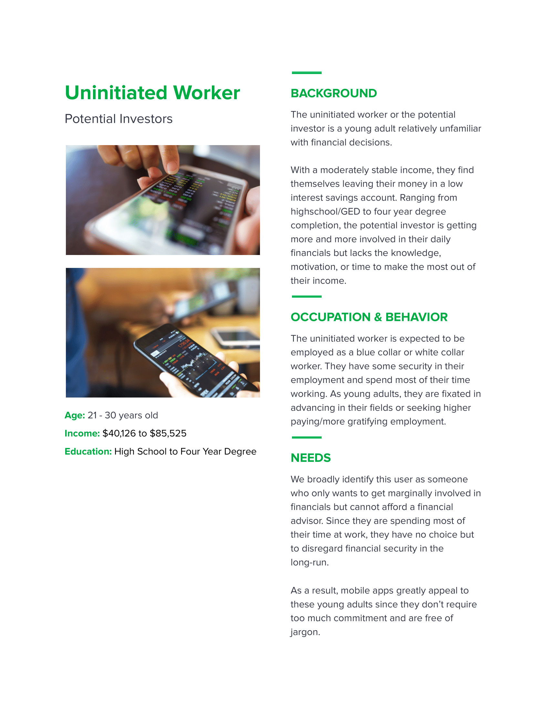
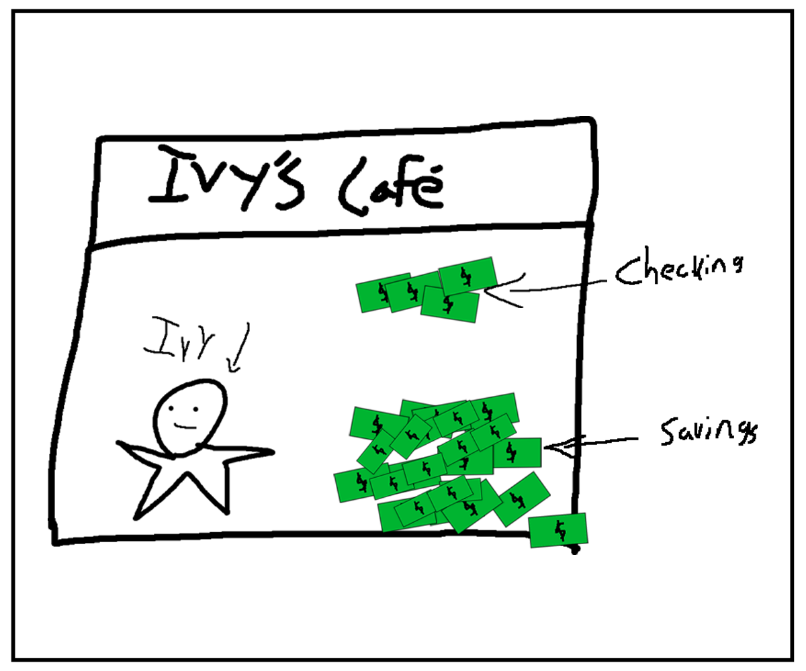
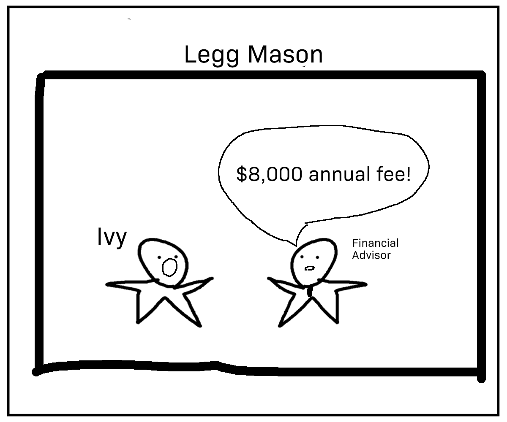
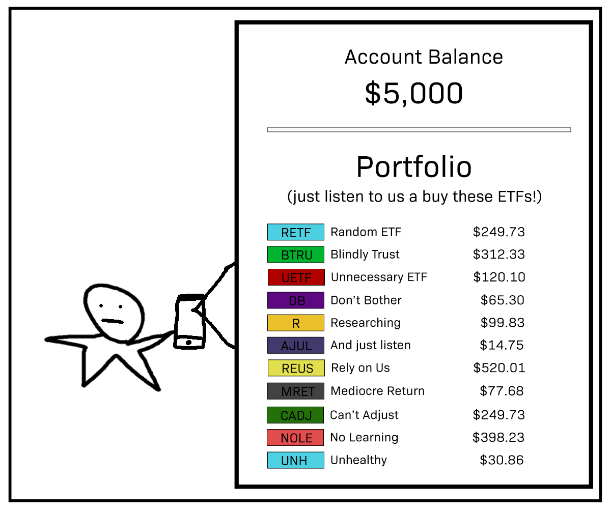
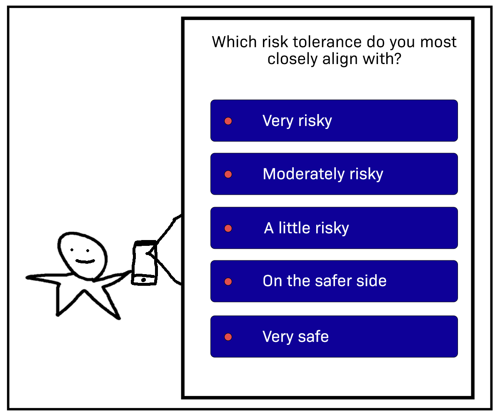
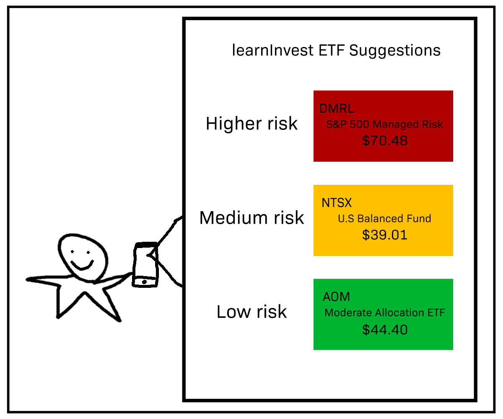
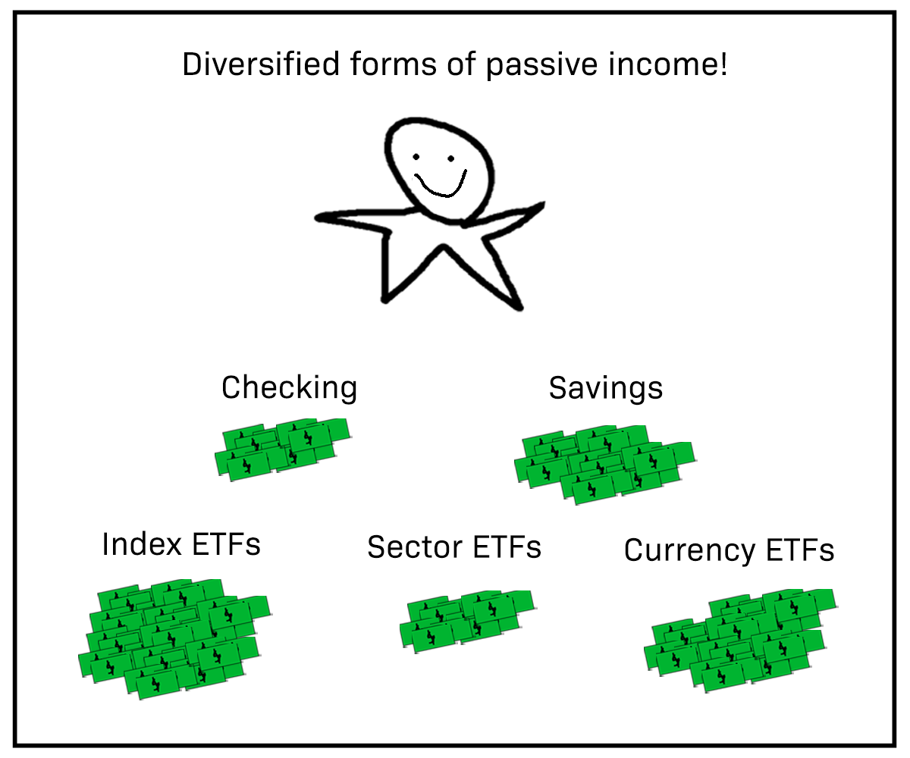

# Problem Statement

There are three main reasons why someone may choose not to trade financial assets: uninterest, lack of time, or risk aversion. These obstacles discourage valuable, potential investors from both expanding their personal wealth and enhancing the efficiency of our financial markets. While a typical robo-adviser aims to address these three concerns, almost all of them conceal their algorithm, preventing users from learning how to invest on their own, thereby reducing the diversity in decisions made in financial markets.

# User Personas

### Persona 1 

### Persona 2

### Persona 3

# Conversation Starters

1. Are you employed/seeking employment?
    + If not, why not?
    + If so, do you enjoy your work?
2. Where do you save your income (savings or checking account, mutual funds, 401K, etc..)?
3. What do you do in your free time?
    + How many hours of free time do you have in a typical week?
4. Do you have an interest in investing?
5. Do you trade any financial assets on any market?
    + If no, why not?
    + If yes, what are some challenges?

# User Interviews

### Bryan: Car Mechanic at Family-Owned Auto Shop

- When did it happen: We conducted the interview with Bryan on March 25th after he closed shop for the day, which was around 8PM.
- How did it happen: Bryan is a close online friend of David's, whom he has known for about a year. Since Bryan is a full-fledged mechanic who meets the requirements of the "Uninitiated Worker," David asked to interview him. We arranged a 30 minute conversation with Bryan in a voice call over a Voice over IP software called Discord. With his consent, we recorded the conversation and reviewed it later to evaluate details.
 

### Brianna: College Student at University of Toronto

- When did it happen: We conducted the interview with Brianna Wang on April 6th around noon.
- How did it happen: Brianna is a childhood friend of Carol's from elementary school. Since they have discusses investing and finance before and she met all the requirements for “college student,” we reached out to her to see if she would be interested in interviewing with us. She typed down her answers over a messaging service called WeChat, which automatically preserves conversations like most messaging services.
    
### Monica: Assistant to CEO of Syracuse Research Corporation

- When did it happen: We conducted the interview with Monica on April 1st at 6:30pm when she had returned home from work.
- How did it happen: Monica works for Meg's father at SRC, and she met all of the requirements for our user persona “Female Professional.” We were able to acquire her contact information from Meg's father. The call lasted around 20-30 minutes over Zoom. We did not record the Zoom, but transcribed her responses in a document for the team members to review (with her consent of course).

    

# Learnings from the User Interviews

### Learning 1

- Bryan did confirm our prior belief the asset trading may appear to be intimidating and convoluted for a beginner. However, we noted that there was a lesser focus on monetary gain compared to the trendiness of investing. Like all of the interviewees, Bryan was not overly interested in finance and was satisfied with his current state of keeping most of his money in savings and checking accounts. As such, when asked about the potential appeal of investing, he responded with mild amusement about the fast-paced and professional lifestyle behind finance commonly seen in films, rather than for monetary gain.

- A key goal in our design is accessibility. In other words, any pedestrian regardless of background should be able to take full advantage of our applications's functionalities immediately. Our interview with Bryan demonstrated to our team that, while simplicity is imperative, the UI should make the user feel as if they are getting heavily involved in financial decisions. That way, a user may be attracted to the "fun" aspect of discovering which financial asset they want to trade. We were reminded that while our app must implement a robust algorithm, another important component is how to attract users: this seems to be a delicate balance of how our app frames the difficulty of investing and the gamification of trading assets.

- In fact, we decided to implement a "Learn more" section, where the user has the option of researching Exchange Traded Funds (ETF) with appropriate figures and graphs. Additionally, including a high-level description of how our algorithm suggested the user's respective ETF may boost retention for future uses.

### Learning 2 

- All three of our interviewees considered the possibility of learning how to invest. While trading assets for financial gain is inherently useful, we were surprised to find that our interviewees were also intrigued by learning the basics of how to invest. Likely due to a combination of social media and personal characteristics, we deducted that we can expect most people to be curious about how robo-advisers generate suggestions for assets to purchase and that an opaque algorithm would be likely to slightly uninterest them

- This observation would help us diversify learnInvest from other typical financial robo-advisers which serve similar purposes. Notably, a major concern about robo-advisers is that they build reliance on the product rather than gradually assist the user to invest intelligently on their own. Hence, while we intend to design our algorithm to be able to compete with other robo-advisers' algorithms, we also implement features that encourage users to glean how our algorithm suggests ETFs. With this knowledge, users would ideally be equipped to invest in financial markets more personally and without excessive reliance on financial software.

- learnInvest's goal should be then to maximize efficiency in financial markets. If agents are bound by an intermediary that they rely on to assist every financial decision, this generates uniform decision making (i.e a single algorithm) when deciding which assets to purchase and sell. Hence, when the algorithm makes a mistake, all of its users will make the same mistake, which (given enough users) could damage financial markets or unilaterally forego opportunities that the algorithm is blind to.

### Learning 3

- while each of our expected user personas are markedly different, our interviews suggest relatively uniform preferences when considering financial investments. A possible reason for this is that most people value money similarly. The college student who should not be willing to invest too much money and has relatively more time than the other personas is still able to gain a sum of money from investing that is proportional to his or her initial assets and opportunity cost. Likewise, the female professional who has more initial assets can recognize greater gains than the college student. In general, someone who is employed has a higher monetary opportunity cost of spending time investing, so he or she will only continue to invest if the returns are high enough.

- If we are able to establish that most people would want to invest regardless of initial assets and amount of free time, we can narrow our app's selling point to the growth potential in terms of financial literacy. All of our user personas acknowledge that they could be interested in the inner-workings of our algorithm, and because most robo-advisers do not offer this feature, our app is likely to be preferable.

- We now modify our problem statement to not only design a cutting edge algorithm (which many robo-advisers have already done!), but to also integrate a learning component for users to eventually graduate from uniform financial decisions. In simpler terms, our algorithm should be the "baseline" to begin attracting users and our educational feature persuades users to select our app over others.

# Storyboarding a Solution

## Frame 1

- Ivy is the owner of a trendy and successful cafe in downtown Baltimore.
- With lighter COVID-19 restrictions on food and drink businesses, Ivy has been experiencing elevated sales.
- After covering variable costs from her business, she places 90% of her earnings in a savings account and the rest in her checking account.

## Frame 2

- After being exposed to the unpredictability of her business's performance due to COVID-19, Ivy begins considering trading financial assets as a supplement to her income, but she is hesitant due to her inexperience and lack of free time.
- While Ivy is interested in finance, she has no prior knowledge, so she arranges a free consultation with a fancy financial adviser from Legg Mason.
- At the consultation, Ivy is shocked to know that the flat annual fee is $8,000, which is far beyond her budget.

## Frame 3

- In search for a cheaper alternative, Ivy discovers an online robo-adviser that only charges $125 per year.
- Ivy trys out the robo-adviser with an account balance of $5,000 to help invest her inactive income, but is confused by how and why this portfolio management software works.
- After five months of testing out the robo-adviser, Ivy finds that she hasn't learned anything about investing on her own, and the lack of personalization is considerably frustrating.

## Frame 4

- Attracted by the flexibility and education component, Ivy decides to try out our app learnInvest, and again lists $5,000 as her initial assets.
- Ivy then completes the interactive survey concerning her risk aversion and impatience.

## Frame 5

- Based on the user survey, learnInvest suggests three Exchange Traded Funds (ETFs) that Ivy can consider to invest in and details explanations for why they may be good matches for her.

## Frame 6

- Pleased by the option to make choices, Ivy decides to invest in two out of three suggested ETFs.
- Ivy is surprised to see that the individual ETFs expect a higher return on investment (ROI) compared to the other robo-investor portfolios.
- Encouraged by the feedback generated by learnInvest's algorithm, Ivy decides to research and invest in a an additional sector ETF with a slightly higher value at risk than her other two ETFs.

## Frame 7

- Throughout the course of six months, Ivy invests an additional $1,000 into each of her three ETFs.
- After six months have passed, Ivy compares her learnInvest's ROI performance with the previous robo-advisers and finds that learnInvest has around 2% higher return. Notably, Ivy's riskier sector ETF performed slightly better than the ETFs that learnInvest suggested.
- Now equipped with the basics in investing, Ivy decides to run learnInvest's algorithm again but increases her initial assets. From the three suggestions, Ivy only selects one and researches two other ETFs based on her own judgement.
- Over the span of a year, Ivy has gained experience in basic investing and now feels more secure in making financial decisions for herself.

# Next Steps

- Based on our outline above, learnInvest's algorithm will be considerably rigorous to implement. The immediate steps would be to develop an algorithm that rivals existing portfolio management robo-advisers, which is bound to be difficult. However, in the beginning stages of learnInvest, the algorithm would generate three ETF suggestions that each maximize expected ROI at varying value at risk (VaR) levels. This feature would not be overly involved, but predicting trends in financial markets is a vast and difficult field--we should expect to spend a lot of time developing an optimal algorithm. 

- Once a working algorithm has been finalized, the educational portion of learnInvest is trivial. Even without having developed the algorithm, we expect that many of our predictors will be multinomial or binary. Hence, when a user satisfies a combination of certain dummy variables, our educational component would detail how his or her demographics correspond to the suggested ETFs. Explaining high-level details of our algorithm to our user is relatively easy, but the developing the algorithm itself is anything but nontrivial.

- After the algorithm is developed, we would focus on implementing our algorithm into the user interface. A first pass at our UI (and a high-level description of our algorithm) is detailed below:

### Summary

The main goal of our app is to almost suggest three Exchange Traded Funds (ETFs) for the user to purchase, calibrated to their initial assets, risk aversion, and impatience. The three suggestions will come in three levels: high risk, medium risk, and low risk. We expect higher risk to typically correspond to higher return. The design layout proceeds as follows: the first section is a short survey evaluating the user’s preferences, the second section suggests three ETFs as detailed above, and the third and final section allows the user to recalibrate his or her preferences.

### First Section

We aim to quantify the user’s initial assets, risk aversion, and impatience. Our webpage/app will allow the user to input a range of how much he or she is willing to invest which we define as approximate initial assets.The following survey question will allow the user to select their level of risk. He or she will be presented with five levels of risk, each of which characterize varying levels of willingness to accept risks. This question will not accept numerical responses. The final question will allow the user to select a range of dates as to when he or she would like to liquidate their investment. Ideally, when a basic algorithm has been developed, we implement a feature that allows the user to leave the date field empty, implying that he or she intends to hold onto the ETF indefinitely.

### Second Section

Based on the survey responses, we aim to design an algorithm that will suggest three ETFs that the user may be interested in. The three ETFs will be described as low risk, medium risk, and high risk--each corresponding with higher levels of return. Depending on the user’s selection for level of risk aversion, we expect the ETF suggestions to calibrate accordingly. Under each ETF suggestion, the projected return and final sell date will be listed. In other words, the algorithm would be programmed to alert the user to sell if the desired rate is achieved--it could also be an option for our product to automatically sell the ETF, if the user prefers. Lastly, under each suggestion, our algorithm will generate explanations for why they were suggested and which characteristics of the ETF are compatible with the user. That way, the user can search for other ETFs on their own.

### Third Section

Lastly, if the user is not satisfied with his or her ETF suggestions, he or she will be presented with an option to return to the survey and adjust responses. Unlike the first iteration, the second version of the survey will allow the user to input a numerical level of risk.

