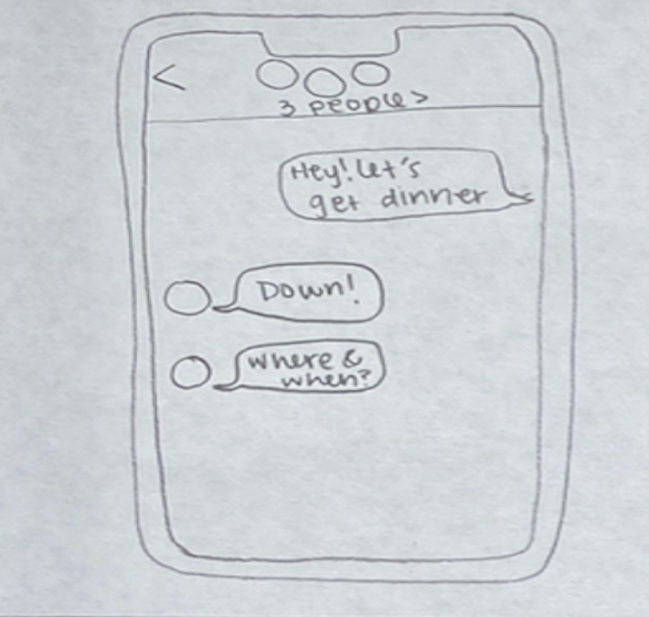
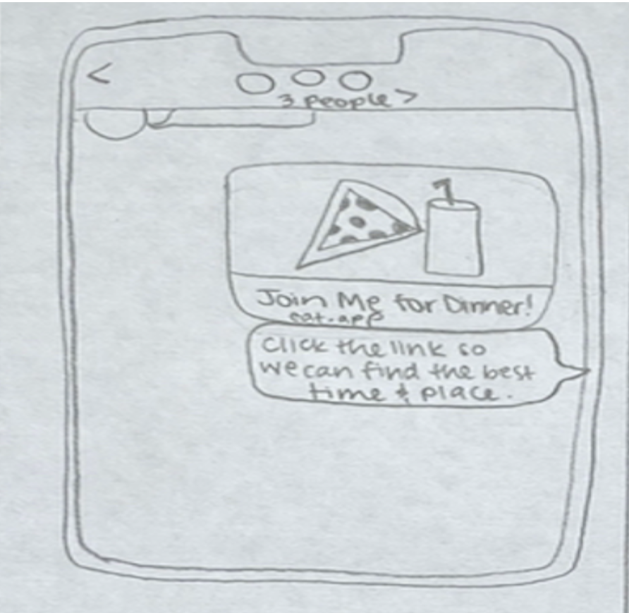
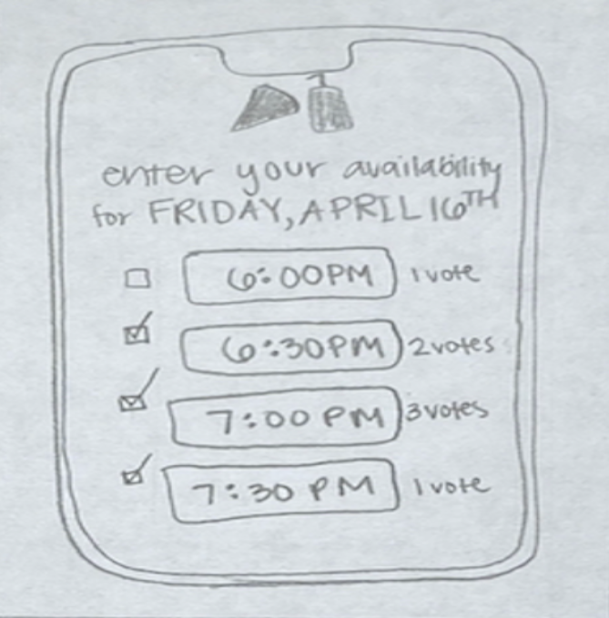
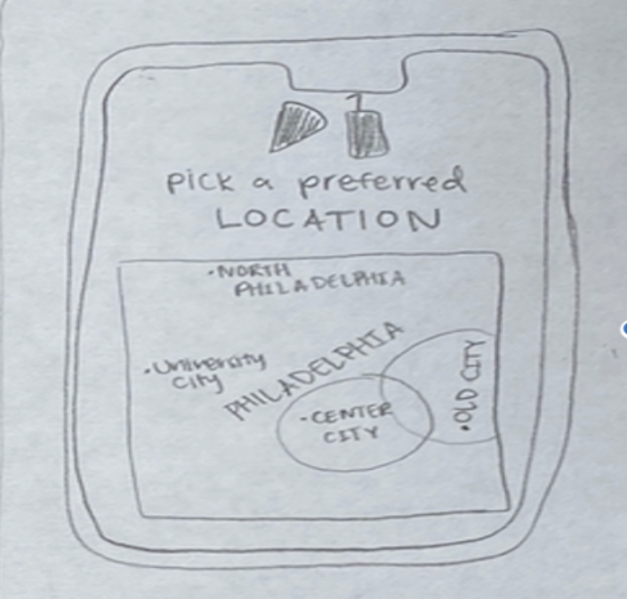
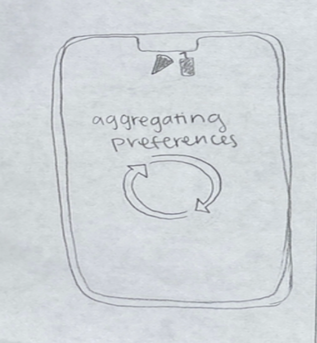
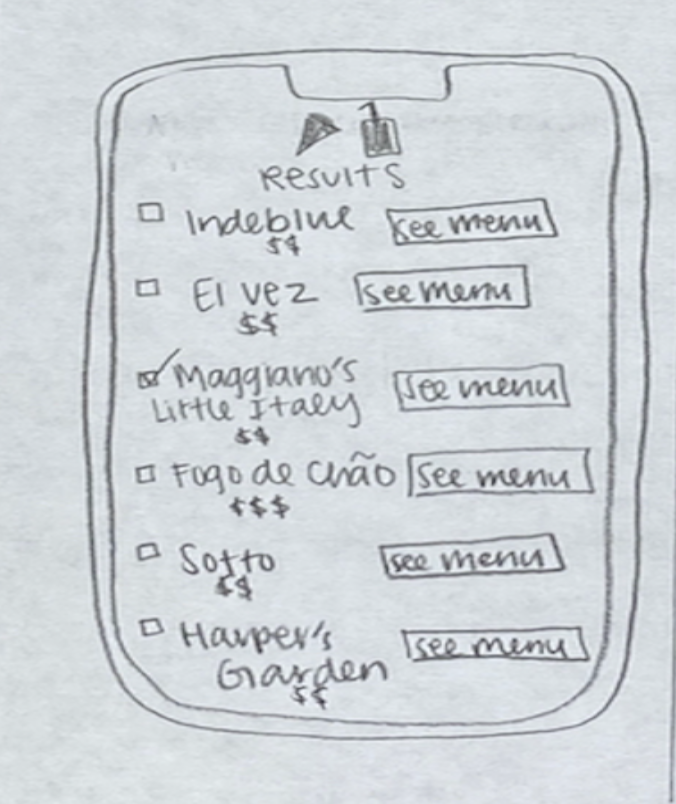
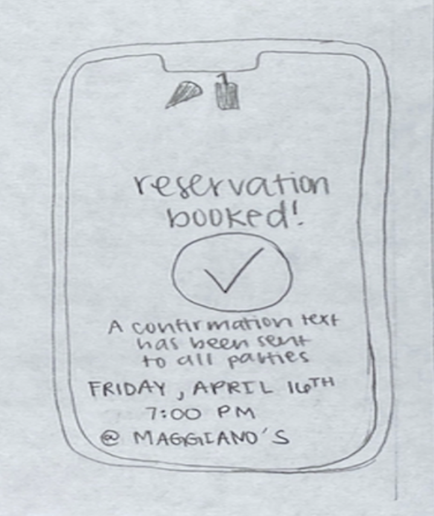
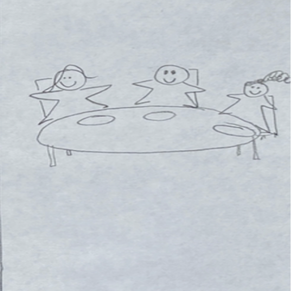

# Problem Statement

Though humans are social creatures that love to spend time engaging the world around us with people we care about, the fact that we all live independent, fast-paced lives can make it difficult to find the time and effort to make plans. More specifically, choosing the optimal time and place to go out to eat with friends can create a lot of inefficiency that can stem from conflicting schedules, repetitiveness in eating choices, and overlooking individual preferences. People crave variety and spontaneity-- they also want the ability to make the most informed decision for themselves with ease, and that’s where our solution comes in.  

# User Personas

### Persona 1 

Personality 1: The College Student
Name: Liam
Age: 21
Personality: Liam is a college student on an urban/suburban campus. Liam is a busy engineering student taking a full course load and is involved with clubs and organizations on campus. With friends from his Greek organization, classes, and extracurriculars, Liam is often making plans to meet up with his friends for dinners or drinks when he has time in his busy schedule. 

### Persona 2

Personality 2:  The busy college graduate
Name: Jessica
Age: 25
Personality: Jessica works in New York City in marketing. She is three years out of college and her friends are all working time intensive jobs. When she can, she loves to reconnect with her college friends and high school friends. It can be hard though with everyone’s demanding schedules, and if plans are made they are often last minute. It can be hard to find the right place to go when they are making last minute reservations.

### Persona 3

Personality 3: The adult: Parent and worker
Name: Micheal
Age: 45
Personality: Micheal lives in the suburbs of an urban city. He has a loving wife and two kids. He works in the city and has a busy work schedule that is often changing because of internal and client meetings. Micheal and his wife often try to make dinner plans with their couple friends at least one night a weekend. Scheduling is hard, but he does his best to block out time. Micheal would love to be able to update his timing and see what times his friends are free to best schedule his meetings and prioritize his family and friends in a way that does not compromise his work.

# Conversation Starters

1. How do you usually choose where to eat with your friends?
2. How often do you go out to eat with friends?
3. What's most important to you when making this decision?
  a. Ask question iteratively with focus on location, cost, type of food, and distance from each attendee (equity)
4. How often do you use food apps?
5. What's the process from idea to dinner when you are making plans currently

# User Interviews

### Interview 1: Zack Leder

* End of March
* Brahm interviewed Zack on a Saturday afternoon. A friend from previous classes, Brahm knew Zack fit the user persona that the group was targeting and Zack was able to give critical information that helped drive our project’s genesis. 

### Interview 2: Zarina Iman 

* Early April
* Ellen interviewed Zarina on a Friday afternoon. She met Zarina through her other friends from New York City and knew from social media that she often goes out to eat at “scene-y” restaurants across the city. 

    
### Interview 3: Natasha Dalmia

* April 2021
* Via a zoom call. Natasha is a friend who frequently dines in Philadelphia. 

### Interview 4: Vaed Khurjekar

* Early April. In person interview. 
*Ivan interviewed Vaed over lunch. Ivan has been good friends with Vaed since freshman year so he knew Vaed fits the ideal user persona the group was targeting given that he is a busy college junior who likes to eat out with friends frequently and often struggles to choose a place and time to meet. 

# Learnings from the User Interviews

### Learning 1

Zack helped refine our MVP by sharing that he had never experienced a conversation about distance between attendees. Zack told us that time, price and food type were the most important things to him, and importantly depending on the day his rankings on how important these factors are to him will change.

### Learning 2 

Zarina revealed that even though she lives in the suburbs and the friends she meets up with live all across NYC, she cares very little about finding an equidistant location to meet up and cares more about the type of restaurant and likes to instead choose a specific location in a cool part of the city. Public transportation is a big part of NYC culture and its pretty normal to travel by train to anywhere within the city. She also helped us determine some features of our app based on her desire for a user-friendly app that is aesthetically pleasing, has pictures of food, and allows for reservation booking. 

### Learning 3

From Natasha we learned people frustrated when trying to find a restaurant, it is problematic to organize the group and that outings are typically organized through a group chat, will sometimes break off into side conversations lasting around 30 minutes. The interview confirmed having a group with unique criteria makes finding a singular place difficult and that cuisine and cost are the biggest factors. We learned that distance is not a relevant factor in the decision making process.

### Learning 4

Vaed helped the group shed some light on the factors that play a larger role in the decision making process –he pointed out that since most of his friends live fairly close to campus, finding a place that is somewhat equidistant from all members of the group is not a priority. As a result, our focus deviated from finding an optimal location for the group to meet toward identifying the best time and restaurant given the diversity of time, location and food type preferences among the group members. 

# Storyboarding a Solution

## Frame 1

* Brahm decides he wants to have an econ 262 team 9 dinner
* Everyone is eager to go, but they are also busy at the moment, and it would be inefficient to text back and forth to decide on the plans
* They are in need of a solution that will help them efficiently find the most optimal place to meet up that represents all of their preferences and desire to eat somewhere that they may not always go

## Frame 2

* Brahm sends a link to the lets.eat app so that everyone can fill in their preferences at their own leisure
* This eliminates the time and energy it would take to text back and forth hashing out ideas and the details of the plans 
* This link is personalized to the group

## Frame 3 

* Each member is able to first enter their time availability for the night they want to go out 
* They are able to check multiple times
* Seeing the number of votes beside each time gives them a better idea of when everyone else is free as well 

## Frame 4

* There might be a certain part of Philly that one of the members is excited to visit, and some may even be indifferent as to location
* Each member can use the map feature to pinpoint the general location they would like to meet at 
* Users can adjust the size of the targeted radius 

## Frame 5

* The app waits for each member of the group to enter their preferences
* Once they do, it will automatically aggregate all of these preferences, eliminating the need to make time for discussion 
* The user data is compiled so that everyone’s voice is heard and no ones preferences are overlooked 

## Frame 6

*A list is compiled of all the restaurants that represent the aggregated preferences
*The relative price range of each is displayed, along with the option to browse through a complete menu with pictures and prices 
*Those displayed are restaurants with available reservations for the time and number of people selected, and users can choose the one that they prefer based on the type of food

## Frame 7

* A reservation is seamlessly booked through the app 
* A confirmation text is sent to each member of the group 
* These reservations are of higher reliability for restaurants and less likely to be canceled since they are representative of the group’s preferences

## Frame 8

* The group heads over to their restaurant of choice and enjoys a great meal that was easy to plan! Everyone is excited because their preferences were taken into consideration 

# Next Steps

Our next steps if we pursue the project further is to make digital mock-ups of the different pages of our app and run another round of user-interviews to gain feedback about how user-friendly and overall engaging our design is. We would like to see if this idea actually solves the key problem and how we can improve. From there would come the design of an actual app that we can release as a trial. 

