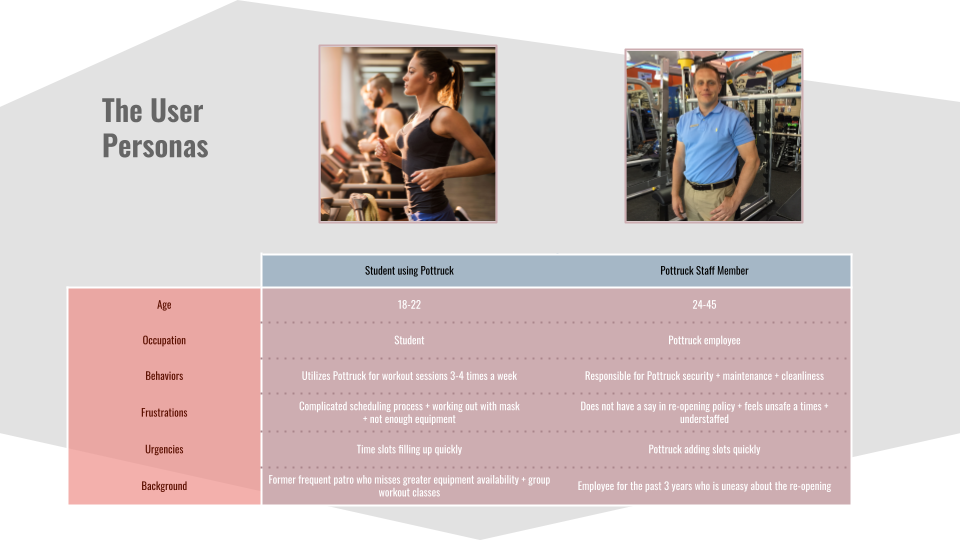
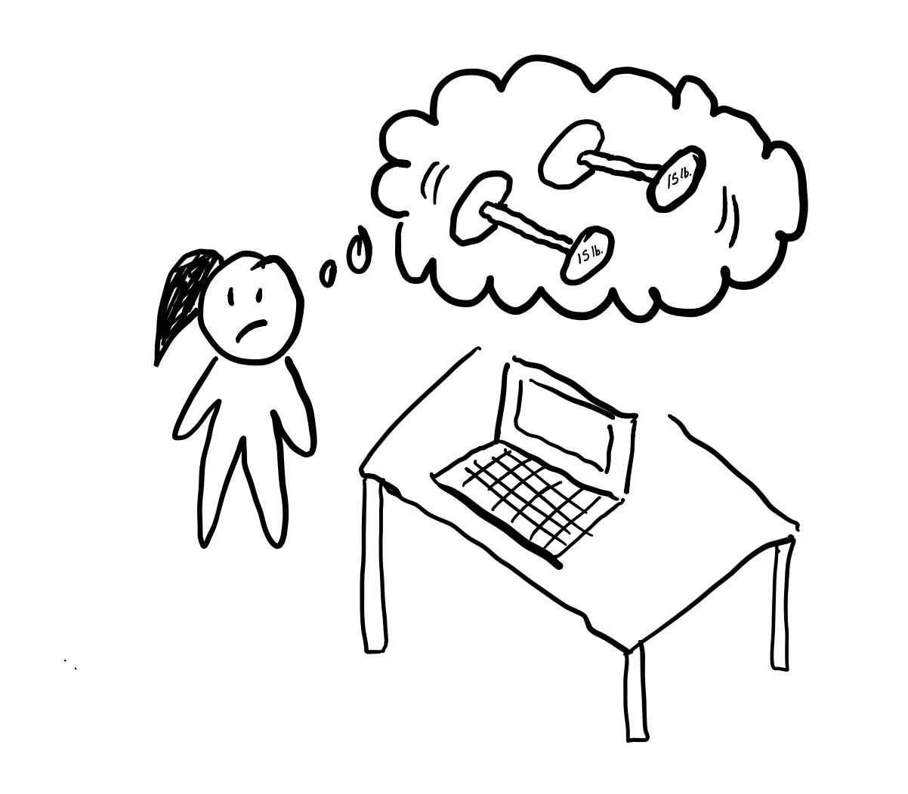
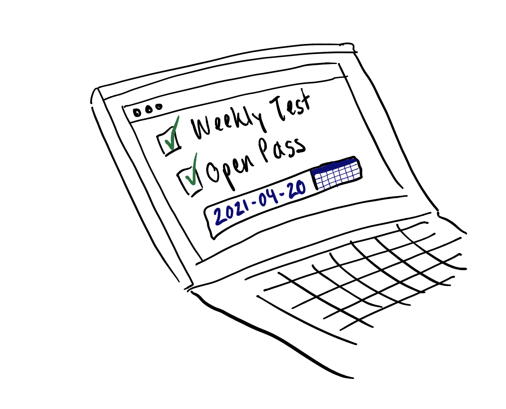
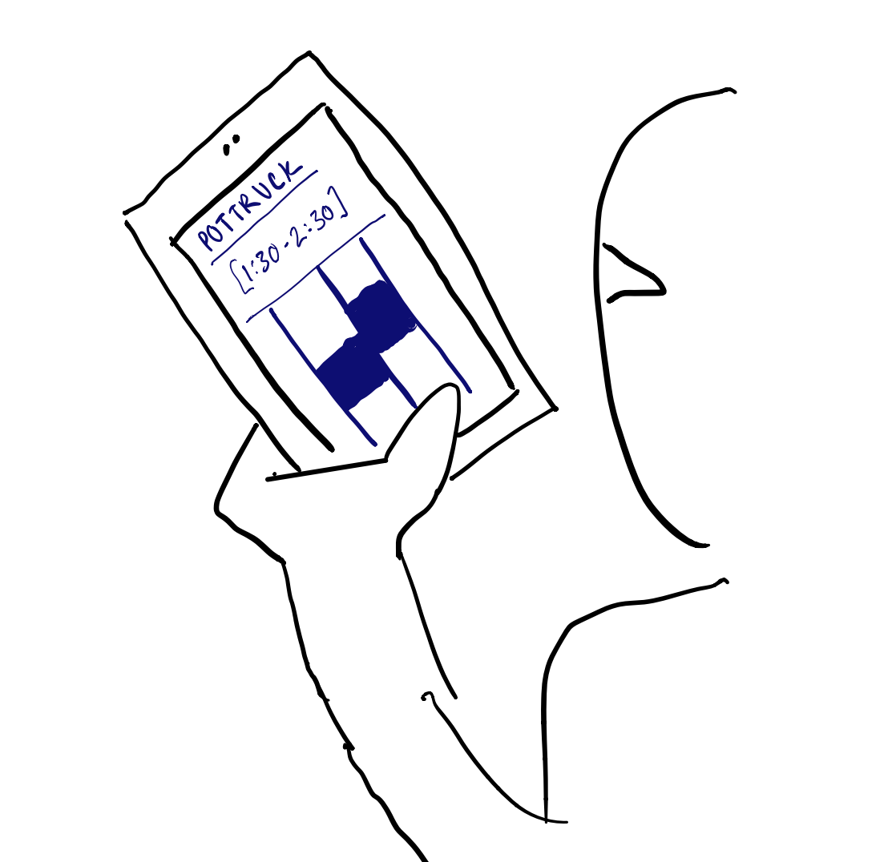
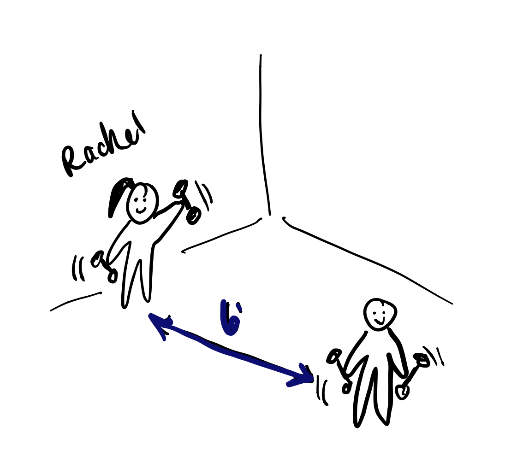

# Problem Statement

Our goal is to help Pottruck reopen while keeping everyone safe in the face of the ongoing pandemic, as gyms are a major vector of spread. Thus, the design problem we originally set out to explore was:

“Who gets to work out at Pottruck and when in order to ensure the safest reopening process possible”.

This problem is relevant to any and all former Penn community members that frequented Pottruck and to the staff who are required to interface with the people who use the facility. It is also a crucially important stepping stone and beta test for Penn’s anticipated full re-opening in the fall.

# User Personas

# Conversation Starters

1. So how often do you use Pottruck in an average week now?
2. Can you tell me a bit about your experiences there? (shifts focus to interviewee)
3. What are your opinions on the Pottruck reopening process? Likes or dislkes?
4. Do you feel safe at Pottruck, and why?
5. What would you change about Pottruck's reopening thus far?

# User Interviews

### Interview 1--Penn Student

On Apr 9th, Joanna interviewed a gym-going friend who often uses the pottruck facilities in a virtual format for covid safety reasons. She asked a variety of questions about her experiences while at the gym, safety, and how to improve her experience.
 

### Interview 2--Pottruck Staff Member

On Apr 11, Dee interviewed a Pottruck Staff member in-person, who kindly gave us time while at work. They discussed reopenng protocol, safety for staff and students, and asked for any comments on the efficacy of current safety measures.

# Learnings from the User Interviews

### Learning 1

Firstly, we learned that most students are following covid safety protocols well, and by integrating students' experience with data on covid transmission, we also learned that most additional restrictions we considered would be unnecessary. Rather, we tweaked our design problem to explore how many people can work out safely at pottruck, given a range of safety measures that are well-followed.

### Learning 2 

Our idea of having outdoor weights was deemed untenable due to equipment degradation and logistics, so we had to ensure that spread could stay low in light of this news. We also learned that the staff sometimes feels unsafe when the gym is at higher capacity, leading us to consider another negative of increasing capacity too much.

 

# Storyboarding a Solution

## Frame 1

A student matching user persona 1 wants to go to the gym, but knows that it's often impossible to find a slot that fits with her schedule, and doesn't like having to wait in lines/get denied at the door.

- This user has used the gym before covid, and is comparing her experience
- Key differences include lack of time slots due to limited availability, discomfort from wearing a mask, lack of equipment

## Frame 2 to 3

- The user logs on to the Penn booking site
- The site checks BEFORE booking for eligibility based on compliance with testing and Penn OpenPass

- Once eligibility is verified, the user can immediately choose a time slot and make a reservation, similar to the current protocol in place

## Frame 4 (final frame)

Our user has made it to the gym! Because of scheduling convenience and eligibility, she wasn't denied at the door and is able to work out safely without putting herself at major risk of infection if Pottruck follows our covid safety recommendations.

# Next Steps

In the future, we would like to extend the SIR model to include quarantined and vaccinated sections, along with their projected rate of change. This will allow for continued modeling of policies as people get vaccinated, and we hypothesize that this will allow for further loosening of restrictions. This will also allow us to model continued covid testing over the semester. We also wanted to test whether separate, maskless rooms for the fully vaccinated would contribute to increased spread, which can be accounted for with the above modifications. Finally, we would like to model decreased social distance (and therefore more equipment) in the gym facilities.
